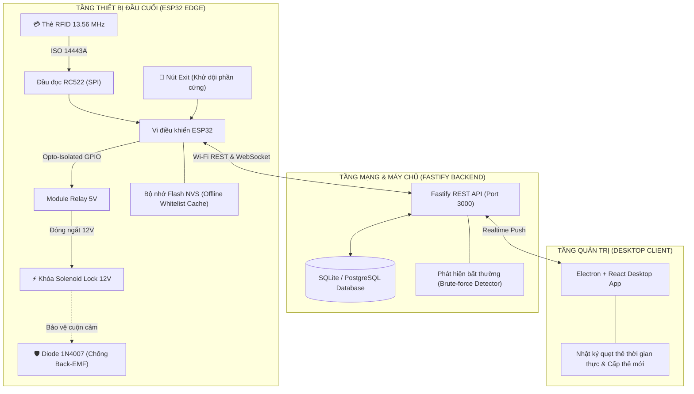
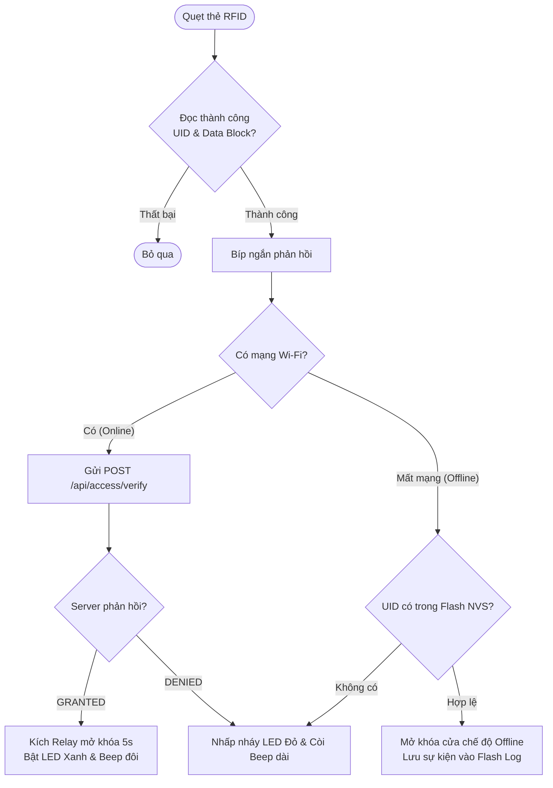

# 🚪 HỆ THỐNG KIỂM SOÁT CỬA RFID & IOT TÍCH HỢP PHẦN MỀM DESKTOP
## IoT-Based RFID Door Access Control System with Desktop Management and Anomaly Detection

[](https://github.com/NguyenHoangUy1305/iot-rfid-access-control/actions/workflows/ci.yml)
[](https://github.com/NguyenHoangUy1305/iot-rfid-access-control)
[](LICENSE)

> **Tên đề tài tốt nghiệp / đồ án:** Xây dựng hệ thống kiểm soát truy cập cửa ứng dụng RFID và IoT, tích hợp phần mềm quản lý desktop và cơ chế phát hiện truy cập bất thường  
> **Tác giả:** Kỹ sư IoT & Hệ thống nhúng (NguyenHoangUy1305)  
> **Thời gian:** Tháng 11/2026 - Tháng 01/2027 (Khởi động chính thức: 01/11/2026)
> **Mục tiêu:** Xây dựng giải pháp kiểm soát ra vào cấp doanh nghiệp với khả năng chịu lỗi ngoại tuyến (Offline Caching), bảo vệ mạch chống xung áp ngược Back-EMF và giao diện giám sát thời gian thực.

---

> 📘 **TÀI LIỆU KỸ THUẬT & LÝ THUYẾT ĐẦY ĐỦ:** Xem chi tiết toàn bộ lý thuyết, công thức vật lý, sơ đồ nối dây và quy trình thực hiện tại [`docs/SO_DO_KY_THUAT_VA_LY_THUYET.md`](./docs/SO_DO_KY_THUAT_VA_LY_THUYET.md) hoặc xem lộ trình 10 tuần tại [`docs/ROADMAP_KY_THUAT.md`](./docs/ROADMAP_KY_THUAT.md).


---

## 1. SƠ ĐỒ KIẾN TRÚC TOÀN HỆ THỐNG



---

## 2. BẢNG ĐẤU NỐI CHÂN PHẦN CỨNG (PINOUT)

> ⚡ **Lưu ý thiết kế chống treo boot (Strapping Pins):** Hệ thống sử dụng **GPIO 26** cho Relay, **GPIO 25** cho Buzzer, **GPIO 27/33** cho LED và **GPIO 32** cho Nút Exit. Hoàn toàn giải phóng các chân Boot Strapping (GPIO 0, 2, 4, 12, 15) giúp ESP32 khởi động 100% tin cậy, không bao giờ rơi vào Flash Download Mode hoặc giật Relay ngoài ý muốn khi bật nguồn!

| Module / Thiết bị | Chân Module | Chân kết nối ESP32 | Điện áp | Chức năng kỹ thuật |
| :--- | :--- | :--- | :--- | :--- |
| **RFID-RC522** | **3.3V** | **3V3 (ESP32)** | 3.3V DC | ⚠️ **CẤM CẮM 5V** (Cháy module MFRC522 lập tức!) |
| | **GND** | **GND** | 0V | Nối mass chung toàn mạch |
| | **RST** | **GPIO 22** | 3.3V Logic | Chân Reset phần cứng |
| | **MISO** | **GPIO 19** | 3.3V Logic | SPI Master In Slave Out |
| | **MOSI** | **GPIO 23** | 3.3V Logic | SPI Master Out Slave In |
| | **SCK** | **GPIO 18** | 3.3V Logic | SPI Serial Clock (10 MHz) |
| | **SDA (SS)** | **GPIO 21** | 3.3V Logic | SPI Chip Select (Active LOW, an toàn) |
| **Relay 5V Module** | **VCC** | **VIN (hoặc 5V)** | 5V DC | Cấp nguồn nuôi cuộn hút relay |
| | **GND** | **GND** | 0V | Nối mass chung |
| | **IN** | **GPIO 26** | 3.3V Logic | Kích mở Relay (Cách ly quang PC817, tránh strapping pin GPIO 4) |
| **Buzzer Chủ Động** | **VCC (+)** | **GPIO 25** | 3.3V Logic | Phát tiếng Beep phản hồi (Tránh strapping pin GPIO 2) |
| | **GND (-)** | **GND** | 0V | Nối mass chung |
| **LED Xanh (Thành công)** | **Anode (+)** | **GPIO 27** | 3.3V qua trở 220Ω | Báo xác thực thẻ hợp lệ / mở cửa |
| | **Cathode (-)** | **GND** | 0V | Nối mass chung |
| **LED Đỏ (Từ chối)** | **Anode (+)** | **GPIO 33** | 3.3V qua trở 220Ω | Báo từ chối thẻ / Cảnh báo an ninh |
| | **Cathode (-)** | **GND** | 0V | Nối mass chung |
| **Nút Nhấn Exit** | **Chân 1** | **GPIO 32** | PULLUP nội | Mở cửa khẩn cấp từ bên trong (RC Debounce, tránh GPIO 15) |
| | **Chân 2** | **GND** | 0V | Nối mass chung |
| **Khóa Solenoid** | **(+ / -)** | **Nguồn 12V 2A** | 12V DC | Mắc song song Diode Flyback 1N4007 ngược chiều để dập dòng Back-EMF |

---

## 3. SƠ ĐỒ THUẬT TOÁN XỬ LÝ QUẸT THẺ (FLOWCHART)



---

## 4. CẤU TRÚC THƯ MỤC
```text
01-rfid-access-control/
├── firmware/       # Mã nguồn C++ ESP32 (PlatformIO / Arduino Framework)
│   ├── src/        # main.cpp, rfid_driver, wifi_manager, offline_cache
│   └── include/    # pin_config.h, app_config.h
├── server/         # Backend REST API (Node.js + TypeScript + Fastify + Prisma)
│   ├── prisma/     # schema.prisma, migrations, seed.ts
│   └── src/        # routes, controllers, services, anomaly_detector.ts
├── desktop/        # Ứng dụng Desktop quản trị (Electron + React + TailwindCSS)
├── docs/           # Sơ đồ kỹ thuật, lý thuyết chuyên sâu, roadmap
│   ├── SO_DO_KY_THUAT_VA_LY_THUYET.md
│   └── ROADMAP_KY_THUAT.md
└── README.md
```

---

## 5. HƯỚNG DẪN KHỞI CHẠY NHANH (QUICK START)
```bash
# 1. Khởi động Server Backend
cd server
npm install
npx prisma migrate dev
npm run dev

# 2. Khởi động Ứng dụng Desktop Quản trị
cd ../desktop
npm install
npm run dev

# 3. Nạp Firmware cho ESP32
cd ../firmware
pio run --target upload
```