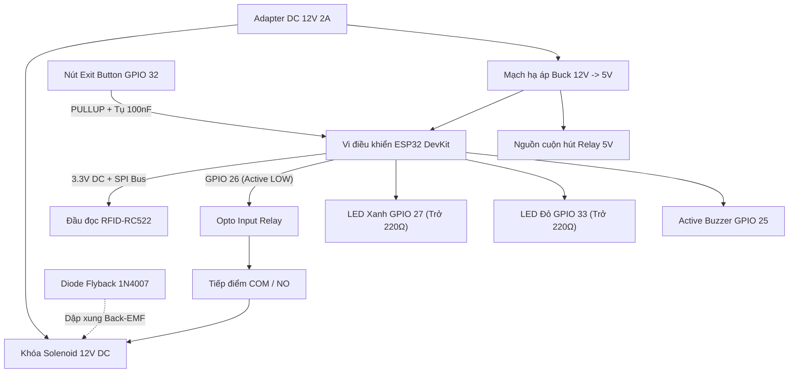
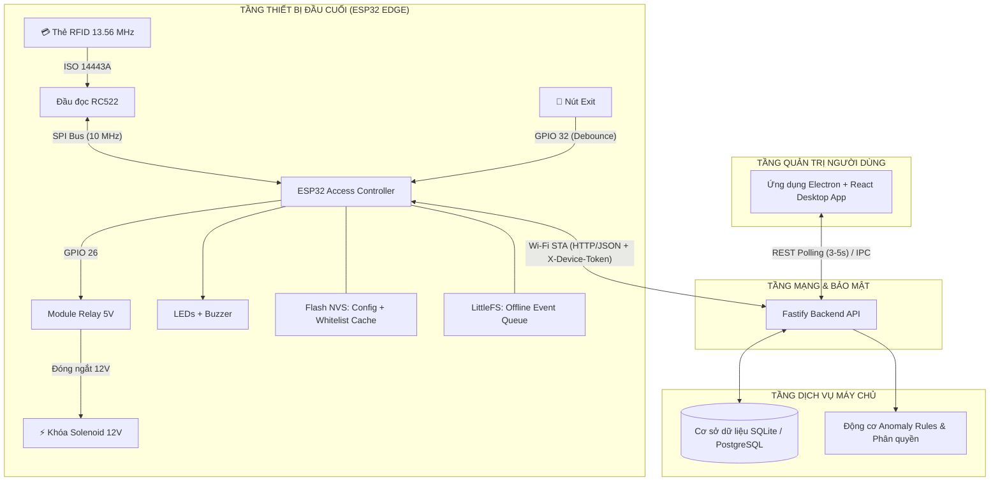
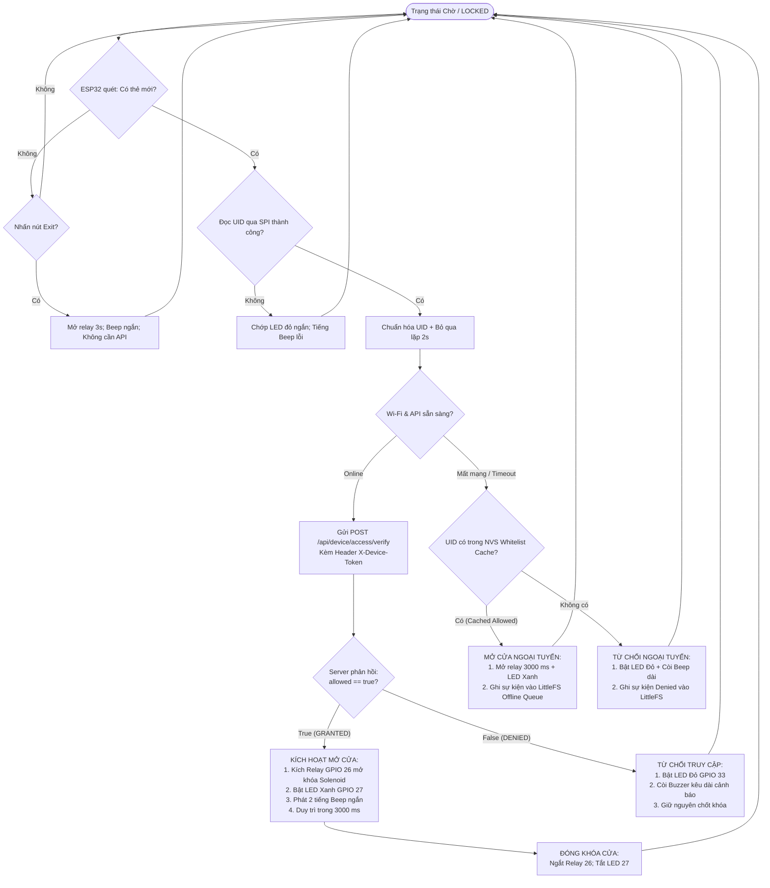
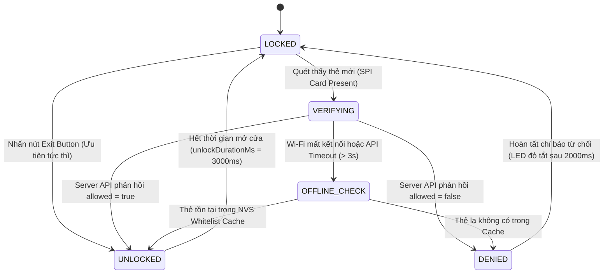
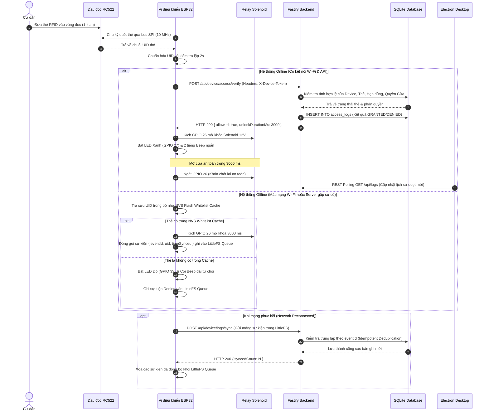

# 📘 SỔ TAY KỸ THUẬT CHUYÊN SÂU
## Sơ đồ kỹ thuật, quy trình và cơ sở lý thuyết
### Hệ thống kiểm soát cửa RFID & IoT tích hợp Desktop App
### ESP32 + RC522 + Fastify + Electron

> **Tác giả:** NguyenHoangUy1305  
> **Repository:** `NguyenHoangUy1305/iot-rfid-access-control`  
> **Phiên bản:** 1.0 — MVP và hướng nâng cấp  
> **Thời gian dự kiến:** 11/2026–01/2027  
> **Phạm vi an toàn:** Mô hình thử nghiệm DC điện áp thấp 3.3 V / 5 V / 12 V. Không nối điện lưới 220 V vào breadboard, relay demo hoặc mô hình này.

---

## Mục lục

1. [Mục tiêu và phạm vi bảo mật](#1-mục-tiêu-và-phạm-vi-bảo-mật)
2. [Cơ sở lý thuyết chuyên sâu](#2-cơ-sở-lý-thuyết-chuyên-sâu)
3. [Sơ đồ kỹ thuật và phần cứng](#3-sơ-đồ-kỹ-thuật-và-phần-cứng)
4. [Luồng xử lý và phần mềm](#4-luồng-xử-lý-và-phần-mềm)
5. [Tài liệu tham khảo](#5-tài-liệu-tham-khảo)

---

# 1. Mục tiêu và phạm vi bảo mật

## 1.1 Mục tiêu kỹ thuật

Hệ thống kiểm soát cửa gồm thiết bị cửa ESP32, đầu đọc RC522, API Fastify, database SQLite/Prisma và ứng dụng Electron quản trị.

```text
Thẻ RFID
→ RC522 đọc UID qua SPI
→ ESP32 gọi Fastify API bằng Wi-Fi/HTTP JSON
→ API xác thực device + card + quyền cửa
→ ESP32 điều khiển relay/LED/buzzer
→ Fastify ghi audit log và tạo alert theo rule
→ Electron quản lý cư dân, thẻ, log và alert
```

MVP bắt buộc phải đáp ứng:
- Đọc, chuẩn hóa chuỗi và chống đọc lặp UID (Card repeat suppression).
- Cấp, khóa, thu hồi và kiểm tra hạn thẻ trên server tập trung.
- Kiểm tra quyền thẻ theo từng cửa cụ thể (`CardDoorPermission`).
- Xác thực thiết bị qua header `X-Device-Token` (được băm SHA-256).
- Ghi audit log cho toàn bộ các lượt grant và deny.
- Chế độ offline cho thẻ đã có trong local whitelist cache (NVS Flash).
- Đồng bộ offline event queue (LittleFS) về server không tạo log trùng (Idempotent Sync).

## 1.2 Giới hạn bảo mật RFID

UID là định danh kỹ thuật, **không phải bí mật**. Một số thẻ có UID thay đổi được (thẻ UID magic / clone); chuẩn MIFARE Classic và đầu đọc RC522 không nên được mô tả là nền tảng chống clone tuyệt đối.

Mục tiêu bảo mật thực tế là phòng vệ nhiều lớp (Defense-in-Depth):
1. **Device token:** Xác thực thiết bị ESP32 với API (bảo vệ chống thiết bị giả mạo).
2. **Trạng thái thẻ tập trung:** `ACTIVE`, `BLOCKED`, `REVOKED`, `EXPIRED`.
3. **Quyền truy cập theo cửa:** Không cho phép thẻ mở cửa không được phân công.
4. **Server-side audit logging:** Ghi log không thể chối bỏ (Non-repudiation).
5. **Rule-based anomaly detection:** Cảnh báo khi có nỗ lực quét thẻ lạ dồn dập hoặc thẻ bị khóa.
6. **Offline policy:** Giới hạn chỉ mở cho các thẻ cache được phép từ trước.
7. **Counter transaction trên thẻ:** Là **Advanced Feature**, chỉ hỗ trợ phát hiện dữ liệu cũ/rollback trong một số tình huống; không chứng minh tuyệt đối thẻ là thẻ gốc.

---

# 2. Cơ sở lý thuyết chuyên sâu

## 2.1 RFID HF 13.56 MHz và Chuẩn ISO/IEC 14443 A

Module RC522 (dựa trên IC MFRC522 của NXP) là một frontend RFID/NFC tần số cao 13.56 MHz thường dùng với thẻ ISO/IEC 14443 A / MIFARE. Hệ thống hoạt động dựa trên cơ chế **ghép cảm ứng từ (Inductive Coupling)** giữa cuộn dây anten của reader và anten của thẻ thụ động (passive tag) trong vùng trường gần (Near-Field).

Bước sóng không gian tự do của sóng mang 13.56 MHz là:

$$\lambda = rac{c}{f} = rac{3 	imes 10^8	ext{ m/s}}{13.56 	imes 10^6	ext{ Hz}} pprox 22.12	ext{ m}$$

Ranh giới chuyển tiếp giữa vùng trường gần bức xạ và vùng trường xa theo lý thuyết anten:

$$r = rac{\lambda}{2\pi} = rac{22.12}{2\pi} pprox 3.52	ext{ m}$$

*Lưu ý kỹ thuật:* Giá trị 3.52 m chỉ là ranh giới lý thuyết điện từ của vùng trường gần (Near-Field Zone), hoàn toàn không phải khoảng cách đọc thẻ của RC522. Khoảng cách đọc thực tế của RC522 phụ thuộc vào hệ số phẩm chất anten ($Q$), loại thẻ, độ ổn định của nguồn 3.3 V, chiều dài dây nối và nhiễu kim loại xung quanh. Với module và thẻ phổ biến trong thực tế, cự ly đọc ổn định thường đạt **1–4 cm** và phải được đo kiểm trên phần cứng thật.

## 2.2 Ghép cảm ứng và cấp nguồn thẻ passive

Đầu đọc tạo ra một từ trường cao tần biến thiên $B(t)$. Anten cuộn dây nhiều vòng của thẻ nằm trong vùng từ trường này sẽ nhận từ thông biến thiên $\Phi(t)$ và sinh ra suất điện động cảm ứng theo định luật cảm ứng điện từ Faraday:

$$e(t) = -N rac{d\Phi}{dt} = -N rac{d}{dt} \iint_S ec{B} \cdot dec{A}$$

Năng lượng điện xoay chiều cảm ứng này được đưa qua mạch chỉnh lưu diode cầu và nạp vào tụ điện tích trữ năng lượng nội bộ bên trong chip thẻ RFID, tạo ra điện áp một chiều $V_{DD}$ (thường khoảng 2V–3V) đủ cấp nguồn nuôi vi điều khiển của thẻ. Nhờ cơ chế này, thẻ passive hoàn toàn không cần pin. Điện dung và điện áp vận hành nội phụ thuộc chip/thẻ cụ thể; dự án không giả định một giá trị cố định cho mọi card.

## 2.3 Tải điều chế (Load Modulation)

Thẻ passive không thể phát sóng vô tuyến chủ động như một máy phát độc lập vì không có nguồn điện riêng. Để truyền dữ liệu ngược lại cho đầu đọc, chip thẻ sử dụng nguyên lý **tải điều chế (Load Modulation)**:
- Thẻ kích hoạt một transistor FET bên trong để đóng/ngắt một điện trở tải hoặc tụ điện song song với cuộn dây anten của thẻ.
- Sự thay đổi trở kháng này làm thay đổi dòng cảm ứng trong thẻ, dẫn đến phản ứng ngược làm thay đổi từ trường ghép đôi, tạo ra những biến thiên nhỏ về biên độ điện áp tại cuộn dây anten của đầu đọc (Reader).
- Ở chuẩn ISO/IEC 14443 A, thẻ điều chế trên sóng mang phụ (subcarrier) $f_s = rac{f_c}{16} = 848	ext{ kHz}$ với phương thức điều chế khóa dịch biên độ (ASK/OOK) hoặc khóa dịch pha (BPSK), từ đó reader giải mã ra chuỗi bit dữ liệu UID.

## 2.4 Cấu trúc bộ nhớ thẻ MIFARE Classic 1K

```text
Dung lượng danh nghĩa: 1024 byte (1 KB) EEPROM
Bao gồm: 16 sector (Sector 0 đến Sector 15)
Mỗi sector: 4 block (Block 0 đến Block 3)
Mỗi block: 16 byte
Block 3 của mỗi sector: Sector Trailer (chứa Key A, Access Bits, Key B)
```

| Phân vùng | Kích thước | Vai trò kỹ thuật |
|---|---:|---|
| **Data Block** (Block 0, 1, 2) | 16 byte / block | Lưu trữ dữ liệu ứng dụng tùy thiết kế |
| **Key A** (Block 3, Byte 0–5) | 6 byte | Khóa bí mật A dùng xác thực truy cập sector |
| **Access Bits** (Block 3, Byte 6–9) | 4 byte (3 byte + 1 byte test) | Định nghĩa quyền đọc/ghi cho từng block trong sector |
| **Key B** (Block 3, Byte 10–15) | 6 byte | Khóa bí mật B (tùy chọn theo cấu hình Access Bits) |

**Sector 0, Block 0 (Manufacturer Block):** Chứa mã định danh duy nhất (UID 4 bytes hoặc 7 bytes), byte kiểm tra BCC và mã thông tin nhà sản xuất. Đối với thẻ chính hãng, block này bị khóa ghi vĩnh viễn (Read-Only) ngay tại nhà máy. Thẻ UID magic của Trung Quốc cho phép ghi đè Sector 0 Block 0 bằng lệnh backdoor, đây là nguồn gốc của việc thẻ có thể bị clone.

*Phân biệt học thuật:* Các thanh ghi $ATQA$ (Answer To Request type A) và $SAK$ (Select Acknowledge) là các phản hồi bắt tay thời gian thực trong pha chống va chạm (Anti-collision cascade level 1/2) của giao thức ISO/IEC 14443 A, không phải là dữ liệu cố định nằm trong Manufacturer Block.

MVP sử dụng UID đọc được từ chu trình anti-collision để tra cứu bản ghi trên server; không bắt buộc đọc/ghi sector hay can thiệp Key A/Key B.

## 2.5 Tải DC cảm và Diode Flyback

Khóa Solenoid 12V là một tải thuần điện trở–cảm kháng ($R - L$). Khi cấp điện, cuộn dây tích lũy năng lượng từ trường:

$$E_L = rac{1}{2} L I^2$$

Khi tiếp điểm Relay ngắt đột ngột, dòng điện $i(t)$ qua cuộn dây bị cưỡng bức giảm về 0 trong thời gian rất ngắn ($dt 	o 0$). Theo định luật tự cảm Faraday và định luật Lenz, sinh ra một suất điện động cảm ứng ngược (Back-EMF):

$$V_L = -L rac{di}{dt}$$

Vì $rac{di}{dt} < 0$ và có trị tuyệt đối cực lớn, $V_L$ sinh ra có thể lên đến hàng trăm Volts với cực tính ngược lại cực tính cấp nguồn ban đầu. Điện áp xung này có thể gây phóng tia lửa điện hồ quang phá hỏng tiếp điểm relay và phát xạ xung nhiễu điện từ (EMI) làm treo hoặc reset ESP32.

**Cơ chế dập xung bằng Diode Flyback (1N4007):**
Diode Flyback được mắc song song ngược cực trực tiếp tại 2 đầu dây khóa Solenoid:
- **Cathode (đầu có vạch trắng)** $	o$ Nối vào cực dương (+) của Solenoid.
- **Anode** $	o$ Nối vào cực âm (-) của Solenoid.

Khi relay đóng, diode bị phân cực ngược và không dẫn điện (chỉ có dòng rò nano-ampe không đáng kể). Khi relay ngắt, điện áp cảm ứng ngược sinh ra làm diode lập tức chuyển sang trạng thái phân cực thuận, tạo thành một mạch vòng kín (recirculation loop). Năng lượng từ trường $E_L$ tiêu tán an toàn dưới dạng nhiệt thông qua điện trở thuần nội bộ của cuộn dây ($R$) và điện áp rơi trên diode ($V_F pprox 0.7	ext{ V}$):

$$V_{	ext{spike\_max}} = V_{CC} + V_F pprox 12	ext{ V} + 0.7	ext{ V} = 12.7	ext{ V}$$

Xung áp ngược bị chặn đứng ở mức an toàn 12.7 V thay vì hàng trăm Volts.

## 2.6 Module Relay và Cách ly quang Optocoupler

Một số module relay 5V tích hợp Optocoupler PC817 nhằm giảm thiểu nhiễu truyền dẫn từ cuộn hút relay sang chân vi điều khiển. Tuy nhiên, việc có mặt của Optocoupler **không đồng nghĩa với việc mạch được cách ly hoàn toàn (Galvanic Isolation)**.

Mức độ cách ly phụ thuộc:
- Module có jumper nối tắt chân `VCC` và `JD-VCC` hay không.
- Nếu jumper còn cắm, nguồn nuôi cuộn hút relay và nguồn cấp cho ESP32 dùng chung 5V và chung mass (GND) $	o$ **Không có cách ly galvanic**.
- Để cách ly hoàn toàn: Rút jumper `VCC/JD-VCC`, cấp nguồn 5V riêng cho `JD-VCC` và `GND` cuộn hút; ESP32 chỉ cấp 3.3V cho chân `VCC` và kéo chân `IN` mà không dùng chung mass.

Nếu mạch thực nghiệm dùng chung adapter 12V qua mạch Buck, việc chung GND là hoàn toàn bình thường; yêu cầu xử lý nghiêm ngặt diode flyback, đường dây tách biệt và tụ bù nguồn.

## 2.7 Dội tiếp điểm nút bấm (Contact Bounce) và Debounce

Nút Exit Button là một công tắc cơ khí. Khi bấm hoặc nhả, các lá đồng va chạm cơ học sẽ dao động đàn hồi trong khoảng vài mili-giây đến vài chục mili-giây trước khi ổn định ở trạng thái dẫn điện hoàn toàn.

- **Debounce phần mềm là cơ chế cốt lõi:** Sử dụng biến thời gian `millis()` với ngưỡng cửa sổ lọc 30–50 ms, tuyệt đối không dùng hàm `delay()` gây chặn luồng FSM.
- **Lọc thông thấp RC phần cứng (Hardware Low-Pass Filter):** Có thể mắc thêm một tụ gốm $C = 100	ext{ nF}$ song song với 2 chân nút bấm kết hợp với điện trở ngoài $R = 10	ext{ k}\Omega$ để triệt tiêu các xung gai cao tần. Hằng số thời gian:

$$	au = R 	imes C = 10\,000\,\Omega 	imes 100 	imes 10^{-9}	ext{ F} = 1	ext{ ms}$$

*Lưu ý:* Điện trở kéo lên nội của ESP32 dao động trong khoảng $45	ext{ k}\Omega - 50	ext{ k}\Omega$, không bằng $10	ext{ k}\Omega$. Nếu tính toán chính xác hằng số $	au = 1	ext{ ms}$, cần dùng điện trở kéo ngoài. Bộ lọc RC 1 ms hỗ trợ dập nhiễu nhanh, không thay thế cho thuật toán debounce phần mềm 30–50 ms.

## 2.8 Phân tích các chuẩn truyền thông SPI, I2C và Wiegand

| Chuẩn giao tiếp | Ứng dụng trong dự án | Đánh giá kỹ thuật |
|---|---|---|
| **SPI** | RC522 kết nối trực tiếp ESP32 | Tốc độ cao (10 MHz), bus 4 dây (SCK, MOSI, MISO, SS). Nhạy cảm với nhiễu nếu dây dài; dây bắt buộc $< 15	ext{ cm}$. |
| **I2C** | Cảm biến môi trường / Màn hình OLED | Tiết kiệm chân (2 dây SDA, SCL), tốc độ 100–400 kHz, cần điện trở kéo pull-up phù hợp. |
| **Wiegand / OSDP** | Kết nối đầu đọc thẻ ngoài cửa xa (10–100 m) | Chuẩn công nghiệp kiểm soát cửa; chống nhiễu vượt trội nhưng không thuộc phạm vi module RC522 local. |

## 2.9 Phân tầng lưu trữ trên vi điều khiển: NVS vs LittleFS

| Tiêu chí | NVS Flash (Preferences) | Phân vùng LittleFS |
|---|---|---|
| **Cơ chế hoạt động** | Key-Value Store trên phân vùng NVS | Hệ thống tệp dạng bảng FAT/LFS với Wear-Leveling |
| **Ứng dụng chuẩn** | Cấu hình thiết bị, Wi-Fi credentials, Whitelist Cache | Hàng đợi sự kiện ngoại tuyến (Offline Event Queue) |
| **Hạn chế** | Tránh ghi liên tục (ghi log quẹt thẻ) gây chai mòn ô nhớ | Tốc độ truy xuất chậm hơn NVS; không lưu bí mật plaintext |

---

# 3. Sơ đồ kỹ thuật và phần cứng

## 3.1 Bảng đấu nối chân an toàn (Safe GPIO Pinout)

Hệ thống loại bỏ hoàn toàn các chân Boot-Strapping nhạy cảm (GPIO 0, 2, 4, 12, 15) để loại trừ triệt để nguy cơ ESP32 bị treo ở Flash Download Mode hoặc giật mở relay lúc bật nguồn.

| Thiết bị ngoại vi | Chân Module | Chân kết nối ESP32 | Mức điện áp | Ghi chú kỹ thuật |
|---|---|---:|---|---|
| **RFID-RC522** | **VCC** | **3V3** | 3.3V DC | ⚠️ **CẤM CẮM 5V** (Cháy IC MFRC522 lập tức) |
| | **GND** | **GND** | 0V | Nối mass chung toàn hệ thống |
| | **SS (SDA)** | **GPIO 21** | 3.3V Logic | SPI Slave Select (Active LOW, an toàn) |
| | **SCK** | **GPIO 18** | 3.3V Logic | SPI Serial Clock ($10	ext{ MHz}$) |
| | **MOSI** | **GPIO 23** | 3.3V Logic | Master Out Slave In |
| | **MISO** | **GPIO 19** | 3.3V Logic | Master In Slave Out |
| | **RST** | **GPIO 22** | 3.3V Logic | Chân Reset phần cứng RC522 |
| **Module Relay 5V** | **VCC** | **5V (VIN)** | 5V DC | Cấp nguồn cuộn hút relay từ ngõ ra 5V |
| | **GND** | **GND** | 0V | Nối mass chung |
| | **IN** | **GPIO 26** | 3.3V Logic | Kích mở Relay (Tránh strapping pin GPIO 4) |
| **Active Buzzer** | **Signal (+)** | **GPIO 25** | 3.3V Logic | Phát âm thanh phản hồi (Tránh GPIO 2) |
| | **GND (-)** | **GND** | 0V | Nối mass chung |
| **LED Xanh (Thành công)** | **Anode (+)** | **GPIO 27** | 3.3V qua trở 220–330 Ω | Báo thẻ hợp lệ / mở cửa |
| | **Cathode (-)**| **GND** | 0V | Nối mass chung |
| **LED Đỏ (Từ chối)** | **Anode (+)** | **GPIO 33** | 3.3V qua trở 220–330 Ω | Báo thẻ bị từ chối / Cảnh báo an ninh |
| | **Cathode (-)**| **GND** | 0V | Nối mass chung |
| **Nút Exit Button** | **Chân 1** | **GPIO 32** | PULLUP nội | Mở cửa khẩn cấp từ bên trong (Tránh GPIO 15) |
| | **Chân 2** | **GND** | 0V | Mắc song song tụ lọc 100 nF |

*Lưu ý lập trình Firmware:* Để triệt tiêu xung giật đóng relay Active-LOW khi khởi động:
```cpp
// Đặt mức logic HIGH (ngắt relay) TRƯỚC khi cấu hình OUTPUT
digitalWrite(GPIO_NUM_26, HIGH);
pinMode(GPIO_NUM_26, OUTPUT);
```

## 3.2 Sơ đồ Relay và Tải khóa Solenoid 12V

Dự án áp dụng cấu hình mạch **High-Side Switching** đảm bảo an toàn điện áp:

```text
                  Nguồn Adapter DC 12V (+)
                            │
                            ├────────────────── Relay COM (Chân chung)
                            │                         │
                            │                         └── Relay NO (Thường mở)
                            │                                  │
                            │                                  └── Khóa Solenoid (+)
                            │                                             │
                            │       ┌─── Diode Flyback 1N4007 ────┐       │
                            │       │   Cathode (Vạch trắng) ─────┤       │
                            │       │   Anode ────────────────────┼───────┘
                            │       └─────────────────────────────┤
                            │                                     │
                  Nguồn Adapter DC 12V (-) ───────────────────────┴── Khóa Solenoid (-)
```

```text
Phân phối nguồn:
Adapter 12V DC ──┬── Mạch Buck DC-DC 12V → 5V ──┬── ESP32 VIN (hoặc 5V)
                 │                               └── Relay VCC (5V)
                 └── Cấp trực tiếp cuộn dây Solenoid qua Relay NO

GND chung:
Adapter 12V GND ── Buck IN(-) ── Buck OUT(-) ── ESP32 GND ── Relay GND ── Solenoid (-)
```

**Chuẩn loại khóa (Fail-Secure vs Fail-Safe):**
- Mô hình thử nghiệm sử dụng **Khóa Solenoid chốt giật (Fail-Secure)**: Mất điện thì chốt khóa vẫn giữ đóng để bảo vệ tài sản, tiếp điểm relay nối qua ngõ **NO (Normally Open)**.
- *Lưu ý PCCC:* Đối với cửa thoát hiểm tòa nhà tuân thủ quy chuẩn PCCC, hệ thống chuyển sang dùng **Khóa hút nam châm điện Maglock (Fail-Safe)**: Mất điện thì khóa tự nhả mở cửa giải cứu cư dân, tiếp điểm relay khi đó nối qua ngõ **NC (Normally Closed)**.

## 3.3 Sơ đồ khối phần cứng (Hardware Block Diagram)



## 3.4 Sơ đồ kiến trúc toàn hệ thống (System Architecture)



---

# 4. Luồng xử lý và phần mềm

## 4.1 Mô hình dữ liệu Backend (Prisma Schema Outline)

- `User`: Quản trị viên và nhân viên bảo vệ (`ADMIN`, `GUARD`), mật khẩu băm bcrypt.
- `Resident`: Thông tin cư dân (họ tên, căn hộ, số điện thoại).
- `Card`: Quản lý thẻ RFID (uid, status: `ACTIVE`, `BLOCKED`, `REVOKED`, `EXPIRED`, residentId).
- `Door`: Thông tin cửa kiểm soát (deviceCode, name, location, active).
- `Device`: Thiết bị đầu cuối (deviceCode, tokenHash, active, lastSeenAt).
- `CardDoorPermission`: Phân quyền thẻ theo cửa (cardId, doorId, isAllowed, validFrom, validUntil).
- `AccessLog`: Nhật ký quẹt thẻ (eventId, receivedAt, deviceEventAt, result, reasonCode).
- `SecurityAlert`: Cảnh báo an ninh (ruleCode, severity, status, createdAt, resolvedAt).

*Nguyên tắc bảo mật:* Server là nguồn thời gian chính thống (`receivedAt`). Giá trị `deviceEventAt` từ ESP32 chỉ dùng tham khảo hoặc sắp xếp hàng đợi khi thiết bị có đồng bộ NTP. Bảng `Device` chỉ lưu SHA-256 hash của token (`tokenHash`), không bao giờ lưu raw token trong database.

## 4.2 Đặc tả API Cốt lõi

### Xác thực quẹt thẻ thời gian thực

```http
POST /api/device/access/verify
X-Device-Token: <raw-device-token>
Content-Type: application/json

{
  "deviceCode": "DOOR_MAIN_01",
  "uid": "a43c9b10",
  "deviceEventAt": "2026-12-09T08:30:00+07:00",
  "nonce": "rnd_8f7b2c"
}
```

```json
{
  "allowed": true,
  "reasonCode": "ACCESS_GRANTED",
  "unlockDurationMs": 3000,
  "alarm": false,
  "serverTime": "2026-12-09T08:30:00+07:00"
}
```

## 4.3 Lưu đồ giải thuật xác thực quẹt thẻ (Flowchart)



## 4.4 Máy trạng thái hữu hạn điều khiển cửa (Door State Machine)



## 4.5 Biểu đồ tuần tự hệ thống (Sequence Diagram)



## 4.6 Chính sách mở cửa ngoại tuyến (Offline Policy)

```text
Chính sách CẤP QUYỀN NGOẠI TUYẾN (Offline Grant):
- Thẻ có UID tồn tại trong NVS Whitelist Cache phiên bản hợp lệ.
- Thẻ có trạng thái ACTIVE và được cấp quyền tại cửa tương ứng ở lần sync gần nhất.
- Kiểm tra tính toàn vẹn Cache qua mã CRC32 không bị lỗi.

Chính sách TỪ CHỐI NGOẠI TUYẾN (Offline Deny):
- UID lạ hoặc không nằm trong Whitelist Cache.
- Thẻ mới cấp phát hoặc thẻ vừa bị khóa/thu hồi sau thời điểm sync cache gần nhất.
- Lệnh mở cửa từ xa (Remote Unlock) không được phép thực hiện khi offline.
```

Khi mạng kết nối lại, ESP32 tự động gửi hàng đợi sự kiện lên endpoint `/api/device/logs/sync`. Server đối chiếu `eventId` duy nhất (UUIDv4) để đảm bảo tính lũy kế (Idempotency), tuyệt đối không bao giờ tạo bản ghi trùng lặp trong cơ sở dữ liệu.

## 4.7 Động cơ phát hiện bất thường (Anomaly Rules MVP)

| Mã luật | Tên quy tắc | Điều kiện kích hoạt | Mức độ cảnh báo |
|---|---|---|---|
| `RULE_01` | Dò thẻ liên tục | 3 lần quét `CARD_NOT_FOUND` trong 60 giây tại cùng 1 cửa | `WARNING` |
| `RULE_02` | Tấn công Brute-force | 5 lần bị `DENIED` liên tiếp trong 60 giây tại cùng 1 cửa | `HIGH_ALERT` |
| `RULE_03` | Quét thẻ đã bị khóa | Thẻ có trạng thái `BLOCKED` hoặc `REVOKED` được quẹt | `SECURITY_ALERT` |
| `RULE_04` | Giả mạo thiết bị | Gửi sai token thiết bị liên tiếp 3 lần trong 5 phút | `DEVICE_ALERT` |

*Giới hạn thiết kế:* Trong mô hình HTTP Request-Response của MVP, Server tạo bản ghi cảnh báo trong bảng `SecurityAlert` và trả về cờ hiệu `alarm: true` trong response của request vượt ngưỡng để thiết bị hú còi tại chỗ. Việc máy chủ chủ động đẩy lệnh tức thời (Push Command) xuống thiết bị để vô hiệu hóa đầu đọc là **Advanced Feature** cần kênh truyền hai chiều như MQTT Broker hoặc WebSocket.

## 4.8 Tiêu chuẩn an toàn ứng dụng Electron Desktop

Ứng dụng quản trị Desktop chạy trên nền tảng Electron tuân thủ nghiêm ngặt các hướng dẫn bảo mật cốt lõi:
- `contextIsolation: true`: Cách ly hoàn toàn ngữ cảnh thực thi giữa Renderer Process và Main Process.
- `nodeIntegration: false`: Vô hiệu hóa việc truy cập trực tiếp các module Node.js nguyên bản từ Renderer.
- `contextBridge`: Chỉ expose các hàm API tối thiểu và an toàn từ `preload.ts` sang Renderer (gửi request lấy log, gửi form nạp thẻ).
- Giao diện Renderer giao tiếp với backend thông qua giao thức chuẩn HTTP REST API; cơ chế IPC nội bộ chỉ dùng duy nhất cho việc tương tác hệ điều hành (thu nhỏ cửa sổ, đóng ứng dụng).

---

# 5. Tài liệu tham khảo

1. **NXP Semiconductors**, *MFRC522 Standard Performance MIFARE and NTAG Frontend*, Product Data Sheet, Rev. 3.9.
2. **Miguel Balboa**, *MFRC522 Arduino RFID Library*, [GitHub Repository](https://github.com/miguelbalboa/rfid).
3. **F. D. Garcia, P. van Rossum, R. Verdult, R. W. Schreur**, *Dismantling MIFARE Classic*, 13th European Symposium on Research in Computer Security (ESORICS), Springer, 2008.
4. **NIST Special Publication 800-98**, *Guidelines for Securing Radio Frequency Identification (RFID) Systems*, National Institute of Standards and Technology.
5. **Espressif Systems**, *ESP32 Technical Reference Manual* & *ESP-IDF GPIO & Strapping Pin Documentation*.
6. **Fastify Framework**, *TypeScript Reference & High-Performance Best Practices Documentation*.
7. **Prisma ORM**, *Prisma Schema Reference, SQLite Migrations and Data Modeling*.
8. **Electron Security Guidelines**, *Security, Native Capabilities, and Context Isolation*, Official Electron Documentation.
9. **OWASP Foundation**, *OWASP API Security Top 10* & *IoT Security Verification Standard (ISVS)*.
