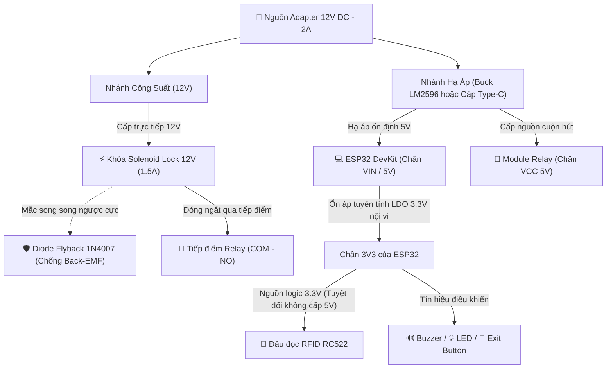
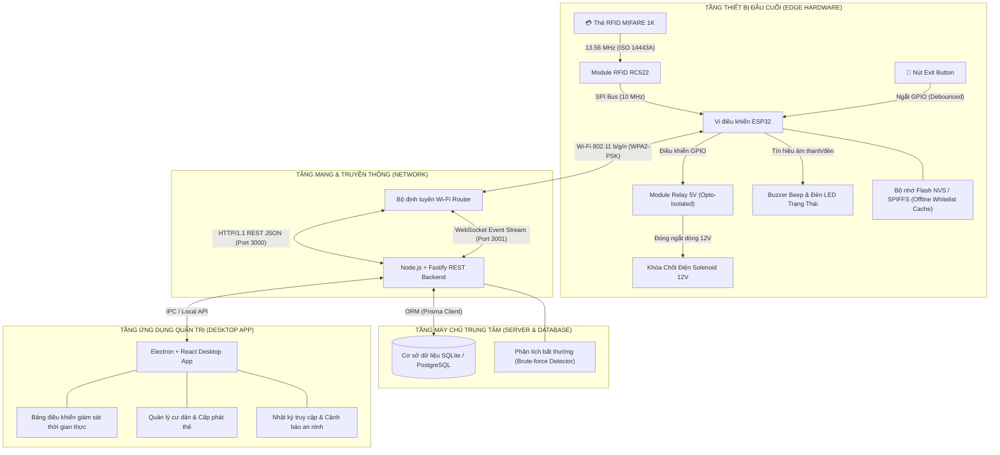
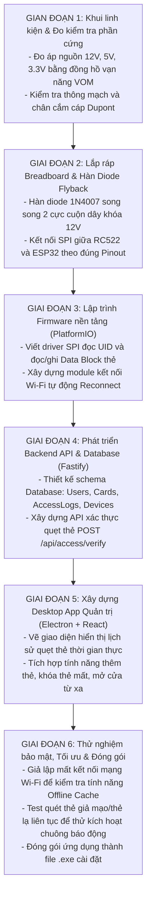
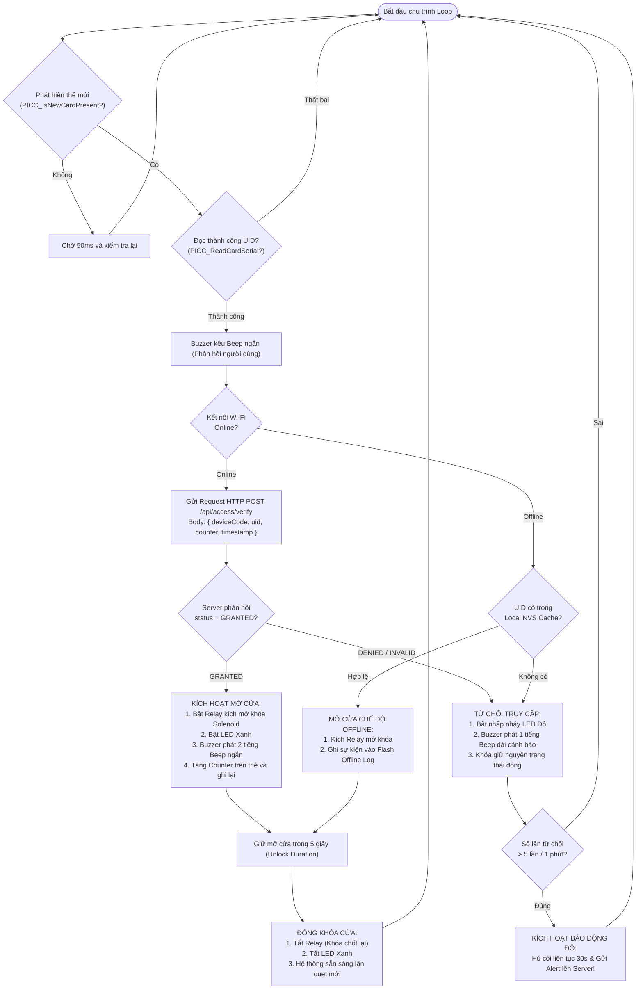
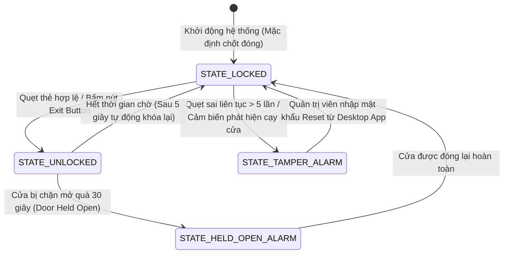

# 📘 SỔ TAY KỸ THUẬT CHUYÊN SÂU: SƠ ĐỒ KỸ THUẬT, SƠ ĐỒ QUY TRÌNH & CƠ SỞ LÝ THUYẾT
## Đề tài: Hệ thống kiểm soát cửa RFID & IoT tích hợp Desktop App (ESP32 + Fastify + Electron)

> **Tác giả:** Kỹ sư IoT & Hệ thống nhúng (NguyenHoangUy1305)  
> **Repository:** [NguyenHoangUy1305/iot-rfid-access-control](https://github.com/NguyenHoangUy1305/iot-rfid-access-control)  
> **Mục đích:** Tài liệu này cung cấp toàn bộ cơ sở lý thuyết chuẩn công nghiệp, các định luật vật lý - điện tử liên quan, sơ đồ kỹ thuật đấu nối mạch chi tiết, và sơ đồ quy trình triển khai hệ thống kiểm soát cửa thông minh từ A đến Z.

---

## MỤC LỤC
1. [PHẦN 1: CƠ SỞ LÝ THUYẾT & NGUYÊN LÝ HOẠT ĐỘNG CHUYÊN SÂU](#phần-1-cơ-sở-lý-thuyết--nguyên-lý-hoạt-động-chuyên-sâu)
   - 1.1 Công nghệ RFID 13.56 MHz & Chuẩn ISO/IEC 14443 Type A
   - 1.2 Cấu trúc bộ nhớ thẻ MIFARE Classic 1K & Bảng phân tích Access Bits
   - 1.3 Lỗ hổng Clone thẻ (Magic Card Gen 1/2) & Cơ chế phòng vệ đa tầng
   - 1.4 Mạch công suất & Tải cảm ứng: Hiện tượng Back-EMF và Diode Flyback
   - 1.5 Hiện tượng dội phím cơ khí (Contact Bounce) & Kỹ thuật Debounce
   - 1.6 Giao thức truyền thông SPI (Serial Peripheral Interface)
   - 1.7 Kiến trúc mạng phân tán & Khả năng chịu lỗi ngoại tuyến (Offline Caching)
2. [PHẦN 2: SƠ ĐỒ KỸ THUẬT & SƠ ĐỒ ĐẤU NỐI MẠCH (PINOUT)](#phần-2-sơ-đồ-kỹ-thuật--sơ-đồ-đấu-nối-mạch-pinout)
   - 2.1 Bảng ánh xạ chân GPIO chi tiết (Hardware Pinout Matrix)
   - 2.2 Sơ đồ nguyên lý mạch điện phần cứng (Hardware Circuit Schematics)
   - 2.3 Sơ đồ phân phối nguồn điện 2 tầng (Power Distribution)
   - 2.4 Sơ đồ kiến trúc kỹ thuật toàn hệ thống (System Architecture)
3. [PHẦN 3: SƠ ĐỒ LÀM & SƠ ĐỒ QUY TRÌNH THỰC HIỆN DỰ ÁN](#phần-3-sơ-đồ-làm--sơ-đồ-quy-trình-thực-hiện-dự-án)
   - 3.1 Quy trình 6 bước triển khai thực chiến từ A-Z
   - 3.2 Sơ đồ thuật toán xử lý quẹt thẻ (Card Verification Flowchart)
   - 3.3 Sơ đồ máy trạng thái khóa cửa (Door State Machine)
   - 3.4 Sơ đồ tuần tự giao tiếp hệ thống (Sequence Diagram)

---

# PHẦN 1: CƠ SỞ LÝ THUYẾT & NGUYÊN LÝ HOẠT ĐỘNG CHUYÊN SÂU

### 1.1. Công nghệ RFID 13.56 MHz & Chuẩn ISO/IEC 14443 Type A
Hệ thống sử dụng sóng vô tuyến dải tần cao **High Frequency (HF) 13.56 MHz** tuân theo tiêu chuẩn quốc tế **ISO/IEC 14443 Type A**.

* **Nguyên lý cảm ứng điện từ (Faraday's Law of Induction):**
  Cuộn anten của module đọc RC522 phát ra từ trường biến thiên $B(t)$ ở tần số $13.56\text{ MHz}$. Khi thẻ RFID đưa vào vùng trường gần (Near Field, cự ly $1 \sim 4\text{ cm}$), cuộn dây phẳng tích hợp bên trong thẻ đón nhận từ thông biến thiên $\Phi(t)$, sinh ra suất điện động cảm ứng $e$ theo định luật Faraday:
  $$e = -N \frac{d\Phi}{dt}$$
  Suất điện động này được mạch nắn diode tích hợp trong chip thẻ chỉnh lưu thành dòng một chiều, nạp vào tụ điện nội vi để cấp nguồn cho vi xử lý bên trong thẻ hoạt động mà không cần pin nuôi (**Passive RFID Tag**).

* **Cơ chế truyền dữ liệu ngược (Load Modulation):**
  Thẻ truyền dữ liệu ngược về đầu đọc bằng cách thay đổi điện trở tải trên cuộn anten của chính nó (bật/tắt transistor tải). Sự thay đổi tải này làm thay đổi nhẹ dòng điện tiêu thụ từ cuộn anten của đầu đọc (Biến điệu tải - Load Modulation trên sóng mang phụ Subcarrier $848\text{ kHz}$). Đầu đọc giải mã sự sụt áp này thành chuỗi nhị phân $0$ và $1$ thông qua mã hóa **Manchester** (chiều thẻ lên đầu đọc) và **Modified Miller** (chiều đầu đọc xuống thẻ).

---

### 1.2. Cấu trúc bộ nhớ thẻ MIFARE Classic 1K & Bảng phân tích Access Bits
Thẻ MIFARE Classic 1K có tổng dung lượng bộ nhớ là **1024 bytes (1 KB)** được phân chia cực kỳ chặt chẽ:
* Gồm **16 Sector** (Sector 0 đến Sector 15).
* Mỗi Sector gồm **4 Block** (Block 0 đến Block 3), mỗi Block chứa đúng **16 bytes** ($16 \times 4 \times 16 = 1024\text{ bytes}$).

```text
+----------+---------+-------------------------------------------------------+
|  Sector  |  Block  | Chức năng & Nội dung chứa                             |
+----------+---------+-------------------------------------------------------+
| Sector 0 | Block 0 | Manufacturer Block: Chứa UID (4/7 bytes) & Dữ liệu SX  |
|          | Block 1 | Data Block (Lưu trữ dữ liệu ứng dụng)                 |
|          | Block 2 | Data Block (Lưu trữ dữ liệu ứng dụng)                 |
|          | Block 3 | Sector Trailer 0 (Key A, Access Bits, Key B)          |
+----------+---------+-------------------------------------------------------+
| ...      | ...     | ...                                                   |
+----------+---------+-------------------------------------------------------+
| Sector 15| Block 0 | Data Block (Block 60)                                 |
|          | Block 1 | Data Block (Block 61)                                 |
|          | Block 2 | Data Block (Block 62)                                 |
|          | Block 3 | Sector Trailer 15: Key A (6B), Access Bits (4B), Key B|
+----------+---------+-------------------------------------------------------+
```

* **Sector 0 - Block 0 (Nhà sản xuất):**
  - Chứa mã định danh duy nhất của thẻ (**UID - Unique Identifier**): Thường là 4 bytes hoặc 7 bytes.
  - Byte thứ 5 là Byte kiểm tra BCC (Block Check Character, tính bằng phép `XOR` của 4 bytes UID).
  - Đối với thẻ chính hãng của NXP, Block này là **Read-Only vĩnh viễn** ngay từ khi xuất xưởng tại nhà máy, không thể ghi đè bằng lệnh thông thường.
* **Block 3 của mỗi Sector (Sector Trailer):**
  - **Bytes 0 - 5:** Khóa bảo mật `Key A` (6 bytes, ví dụ: `0xFF 0xFF 0xFF 0xFF 0xFF 0xFF`).
  - **Bytes 6 - 9:** Các bit truy cập (`Access Bits` - 4 bytes quy định quyền đọc/ghi cho từng block trong sector).
  - **Bytes 10 - 15:** Khóa bảo mật `Key B` (6 bytes, tùy chọn dùng để xác thực 2 chiều).

---

### 1.3. Lỗ hổng Clone thẻ (Magic Card Gen 1/2) & Cơ chế phòng vệ đa tầng
* **Bản chất lỗ hổng sao chép thẻ:**
  Các loại thẻ Trung Quốc trôi nổi ("Magic Card" UID Gen 1 hoặc CUID Gen 2) có chip mở backdoor cho phép chấp nhận các lệnh đặc biệt (lệnh `0x40`/`0x43`) để ghi đè dữ liệu vào cả **Sector 0 Block 0**. Do đó, kẻ gian có thể dùng đầu đọc cầm tay sao chép nguyên vẹn mã UID của thẻ cư dân sang một thẻ trắng chỉ trong 2 giây!
* **Tại sao chỉ dùng UID là KHÔNG ĐỦ BẢO MẬT?**
  Nếu hệ thống chỉ đọc UID rồi gửi lên server mở cửa, kẻ gian sao chép UID sẽ dễ dàng đột nhập.
* **Chiến lược bảo mật đa lớp (Defense-in-Depth) của dự án:**
  1. **Quản lý danh sách thẻ động (Server-Managed State):** Server gán mỗi thẻ trạng thái thời gian thực (`ACTIVE`, `SUSPENDED`, `LOST_REPORTED`).
  2. **Ghi mã xác thực động (Dynamic Rolling Nonce / Counter):**
     Hệ thống không chỉ đọc UID mà còn dùng `Key A` bí mật xác thực và đọc **Data Block 1** của Sector 1. Tại đây lưu trữ một Counter mã hóa. Mỗi lần quẹt thẻ thành công, ESP32 tăng Counter thêm 1 và ghi ngược lại vào thẻ. Nếu thẻ clone dùng bản sao cũ có Counter nhỏ hơn giá trị đã lưu trên Server -> Lập tức kích hoạt chuông báo động và khóa thẻ!
  3. **Thuật toán phát hiện quét thẻ bất thường (Brute-Force Anomaly Detection):**
     Nếu phát hiện một đầu đọc nhận liên tiếp 5 lần quét thẻ không hợp lệ trong 60 giây, hệ thống tự động khóa cổng đọc 3 phút và gửi cảnh báo đỏ lên Dashboard Desktop.

---

### 1.4. Mạch công suất & Tải cảm ứng: Hiện tượng Back-EMF và Diode Flyback
Khóa chốt từ Solenoid Lock 12V là một **tải thuần cảm** (Inductive Load) có độ tự cảm $L$.

* **Hiện tượng Sức điện động cảm ứng ngược (Back-EMF / Inductive Kick):**
  Khi khóa đóng, dòng điện $I \approx 1.5\text{ A}$ chạy qua cuộn dây tạo ra từ trường mạnh. Khi Relay ngắt điện, dòng điện giảm về 0 đột ngột trong thời gian rất ngắn ($dt \to 0$). Theo định luật tự cảm:
  $$V_{kick} = -L \frac{di}{dt}$$
  Điện áp ngược $V_{kick}$ có thể vọt lên tới **$200\text{ V} \sim 400\text{ V}$**. Xung áp cao này sinh ra tia lửa điện đánh thủng tiếp điểm Relay, phát ra sóng điện từ (EMI) truyền ngược qua đường mass, làm sập nguồn ESP32 (lỗi Brownout Reset) hoặc phá hủy vi điều khiển!
* **Giải pháp bắt buộc: Mắc Diode Flyback (1N4007):**
  - Mắc song song một diode 1N4007 **ngược cực tính** với nguồn 12V cấp cho cuộn dây khóa (Cathode nối vào $+12\text{V}$, Anode nối vào cực âm/Relay).
  - Khi ngắt nguồn, dòng điện cảm ứng tự tuần hoàn khép kín qua Diode và tiêu tán năng lượng từ trường $\frac{1}{2}LI^2$ dưới dạng nhiệt trên điện trở nội của cuộn dây, triệt tiêu hoàn toàn xung áp nhọn bảo vệ mạch tuyệt đối.
* **Mạch cách ly quang (Optocoupler Isolation PC817):**
  Module Relay có tích hợp IC Optocoupler PC817, giúp truyền tín hiệu kích mở bằng tia hồng ngoại, cô lập hoàn toàn mass tín hiệu số $3.3\text{V}$ của ESP32 với mass nguồn công suất $12\text{V}$ của khóa cửa.

---

### 1.5. Hiện tượng dội phím cơ khí (Contact Bounce) & Kỹ thuật Debounce
Nút bấm Exit Button (mở cửa từ bên trong) sử dụng tiếp điểm cơ khí kim loại dạng lò xo.

* **Bản chất dội phím:**
  Khi người dùng bấm hoặc nhả nút, hai thanh kim loại không tiếp xúc êm ái mà va đập nảy qua nảy lại nhiều lần trong khoảng $5\text{ ms} \sim 20\text{ ms}$ trước khi ổn định. Điều này làm chân GPIO của ESP32 ghi nhận hàng chục xung ngắt đóng mở liên tiếp.
* **Kỹ thuật xử lý Debounce:**
  - **Phần cứng:** Mắc tụ gốm $100\text{ nF}$ song song với nút nhấn kết hợp điện trở kéo lên Pull-up $10\text{ k}\Omega$ tạo thành mạch lọc thông thấp RC (Low-Pass Filter) triệt tiêu các gai nhọn.
  - **Phần mềm (Non-blocking):** Không dùng hàm `delay()`. Sử dụng biến lưu mốc thời gian `lastDebounceTime = millis()`: Chỉ chấp nhận trạng thái nút thay đổi nếu tín hiệu duy trì ổn định liên tục quá ngưỡng $50\text{ ms}$.

---

### 1.6. Giao thức truyền thông SPI (Serial Peripheral Interface)
Module đọc thẻ RC522 kết nối với ESP32 thông qua chuẩn giao tiếp đồng bộ nối tiếp tốc độ cao **SPI**:
* **4 đường tín hiệu:**
  - `SCK` (Serial Clock): Xung đồng hồ do Master (ESP32) phát ra điều khiển nhịp truyền tin (tần số lên tới $10\text{ MHz}$).
  - `MOSI` (Master Out Slave In): Đường truyền lệnh và dữ liệu từ ESP32 xuống RC522.
  - `MISO` (Master In Slave Out): Đường truyền dữ liệu thẻ đọc được từ RC522 về ESP32.
  - `SS / SDA` (Slave Select): Chân chọn chip tích cực mức thấp (LOW), cho phép vi điều khiển giao tiếp đúng thiết bị.
* **Chế độ SPI:** Chuẩn Mode 0 ($CPOL = 0, CPHA = 0$ - lấy mẫu ở sườn lên của xung clock). Tốc độ vượt trội gấp 25 lần so với giao tiếp $I^2C$ ($400\text{ kHz}$), đảm bảo tốc độ phản hồi tức thì dưới $10\text{ ms}$ khi quẹt thẻ lướt qua.

---

### 1.7. Kiến trúc mạng phân tán & Khả năng chịu lỗi ngoại tuyến (Offline Caching)
Hệ thống không phụ thuộc hoàn toàn vào đường truyền Internet:
* **Trạng thái Online:** Khi có Wi-Fi, ESP32 đóng vai trò HTTP Client gửi gói tin JSON qua REST API tới Fastify Server. Server tra cứu cơ sở dữ liệu SQLite/PostgreSQL, kiểm tra quyền và trả về JSON phản hồi trong $< 80\text{ ms}$.
* **Trạng thái Offline (Mất mạng Wi-Fi / Đứt cáp):**
  - ESP32 liên tục gửi gói tin Heartbeat thăm dò Server mỗi 15 giây. Nếu 3 lần liên tiếp mất kết nối, hệ thống tự động kích hoạt **Offline Fallback Mode**.
  - ESP32 đọc bảng danh sách thẻ hợp lệ (Local Whitelist Hash Table) được lưu sẵn trong bộ nhớ **NVS Flash (Non-Volatile Storage)** hoặc **SPIFFS**.
  - Khi có thẻ quẹt, vi điều khiển tra cứu bộ nhớ Flash nội vi để quyết định mở cửa. Sự kiện mở cửa ngoại tuyến được lưu vào hàng đợi đệm (Offline Event Log).
  - Khi Wi-Fi phục hồi, ESP32 tự động đẩy toàn bộ lịch sử quẹt thẻ ngoại tuyến lên Server để đồng bộ lại cơ sở dữ liệu.

---

# PHẦN 2: SƠ ĐỒ KỸ THUẬT & SƠ ĐỒ ĐẤU NỐI MẠCH (PINOUT)

### 2.1. Bảng ánh xạ chân GPIO chi tiết (Hardware Pinout Matrix)

| Thiết bị / Module | Chân Module | Chân kết nối ESP32 | Mức điện áp | Ghi chú kỹ thuật an toàn |
| :--- | :--- | :--- | :--- | :--- |
| **RFID-RC522** | **3.3V** | **3V3 (ESP32)** | 3.3V DC | ⚠️ **CẤM CẮM 5V** (Cháy IC MFRC522 lập tức!) |
| | **GND** | **GND** | 0V | Nối chung mass toàn hệ thống |
| | **RST** | **GPIO 22** | 3.3V Logic | Chân Reset phần cứng module |
| | **MISO** | **GPIO 19** | 3.3V Logic | SPI Master In Slave Out |
| | **MOSI** | **GPIO 23** | 3.3V Logic | SPI Master Out Slave In |
| | **SCK** | **GPIO 18** | 3.3V Logic | SPI Serial Clock |
| | **SDA (SS)** | **GPIO 5** | 3.3V Logic | SPI Chip Select (Active LOW) |
| **Relay Module** | **VCC** | **VIN (hoặc 5V)** | 5V DC | Cấp nguồn nuôi cuộn hút relay qua Opto |
| | **GND** | **GND** | 0V | Mass chung |
| | **IN** | **GPIO 4** | 3.3V Logic | Kích mở Relay (Mức LOW hoặc HIGH tùy module) |
| **Còi Buzzer** | **VCC (+)** | **GPIO 2** | 3.3V Logic | Buzzer chủ động (Active 3.3V) phát tiếng Beep |
| | **GND (-)** | **GND** | 0V | Mass chung |
| **LED Xanh (Mở)** | **Anode (+)** | **GPIO 16** | 3.3V qua $220\Omega$ | Báo hiệu xác thực thành công |
| **LED Đỏ (Khóa)** | **Anode (+)** | **GPIO 17** | 3.3V qua $220\Omega$ | Báo hiệu từ chối thẻ / Báo động |
| **Nút bấm Exit** | **Chân 1** | **GPIO 15** | Kéo nội trở PULLUP | Nút bấm cơ mở cửa khẩn cấp từ bên trong |
| | **Chân 2** | **GND** | 0V | Nhấn nút nối chân 1 xuống GND |
| **Khóa Solenoid** | **Dây (+)** | **Nguồn +12V DC**| 12V DC (1.5A)| Nguồn adapter 12V rời |
| | **Dây (-)** | **Relay NO** | Tiếp điểm | Chân COM của Relay nối về GND 12V |
| **Diode 1N4007** | **Cathode** | **Khóa (+12V)** | Phân cực ngược | Vạch trắng nối vào nguồn dương 12V |
| | **Anode** | **Khóa (Dây -)** | Phân cực ngược | Mắc song song trực tiếp tại 2 cọc cuộn dây khóa |

---

### 2.2. Sơ đồ nguyên lý mạch điện phần cứng (Hardware Circuit Schematics)

```text
       +-------------------------------------------------------------+
       |               SƠ ĐỒ ĐẤU NỐI MẠCH PHẦN CỨNG CHI TIẾT          |
       +-------------------------------------------------------------+

      [NGUỒN 12V DC 2A]
         │        │
         │ (+)    └──(GND)───────────────────────────────┐
         │                                               │
         ├───[Buck LM2596: 12V -> 5V]───(+) 5V──>[VIN]   │
         │                                  │    [ESP32] │
         │   ┌──────────────────────────────┴───>[GND]───┤ (Mass chung)
         │   │                                           │
         │   │   +-------------------------+             │
         │   │   |    ESP32 DEVKIT V1      |             │
         │   │   |                         |             │
         │   │   | 3V3 ─────────────────(3.3V) RFID RC522│
         │   │   | GND ─────────────────(GND)            │
         │   │   | GPIO 5 (SS)──────────(SDA)            │
         │   │   | GPIO 18 (SCK)────────(SCK)            │
         │   │   | GPIO 23 (MOSI)───────(MOSI)           │
         │   │   | GPIO 19 (MISO)───────(MISO)           │
         │   │   | GPIO 22 (RST)────────(RST)            │
         │   │   |                         |             │
         │   │   | GPIO 4 ──────────────(IN) RELAY 5V    │
         │   └───| 5V/VIN ──────────────(VCC) MODULE     │
         │       | GND ─────────────────(GND)            │
         │       |                         |             │
         │       | GPIO 2 ──────────────(+) ACTIVE BUZZER│
         │       | GPIO 16 ──[220Ω]─────(+) LED XANH     │
         │       | GPIO 17 ──[220Ω]─────(+) LED ĐỎ       │
         │       | GPIO 15 ─────────────[NÚT NHẤN EXIT]──┤
         │       +-------------------------+             │
         │                                               │
         │                                               │
         ├───(+)12V────────┐                             │
         │                 │                             │
         │           [KHÓA TỪ 12V]                       │
         │            ▲         │                        │
         │     1N4007 │         │                        │
         │     Diode  │         ▼                        │
         │            └───(NO) RELAY (COM)───────────────┘
         │
         └───────────────────────────────────────────────────────────
```

---

### 2.3. Sơ đồ phân phối nguồn điện 2 tầng (Power Distribution)



---

### 2.4. Sơ đồ kiến trúc kỹ thuật toàn hệ thống (System Architecture)



---

# PHẦN 3: SƠ ĐỒ LÀM & SƠ ĐỒ QUY TRÌNH THỰC HIỆN DỰ ÁN

### 3.1. Quy trình 6 bước triển khai thực chiến từ A-Z



---

### 3.2. Sơ đồ thuật toán xử lý quẹt thẻ (Card Verification Flowchart)



---

### 3.3. Sơ đồ máy trạng thái khóa cửa (Door State Machine)



---

### 3.4. Sơ đồ tuần tự giao tiếp hệ thống (Sequence Diagram)

```mermaid
sequenceDiagram
    autonumber
    actor Resident as Cư dân
    participant RC522 as Đầu đọc RC522
    participant ESP32 as Vi điều khiển ESP32
    participant Relay as Khóa Solenoid (Relay)
    participant Server as Fastify Backend
    participant DB as SQLite Database
    participant Desktop as Electron Desktop App

    Resident->>RC522: Đưa thẻ RFID vào vùng đọc (1-4cm)
    RC522->>ESP32: Bắn ngắt SPI truyền mã UID + Data Block
    ESP32->>ESP32: Bật Buzzer Beep ngắn phản hồi

    alt Kết nối mạng Online
        ESP32->>Server: POST /api/access/verify { uid: "8A3B21F0", deviceId: "DOOR_01" }
        Server->>DB: Query bảng Cards & Residents (Check status & permissions)
        DB-->>Server: Trả về kết quả { valid: true, residentName: "Nguyen Van A" }
        Server->>DB: INSERT INTO AccessLogs (uid, status, timestamp)
        Server-->>ESP32: HTTP 200 { status: "GRANTED", duration: 5000 }
        Server-->>Desktop: WebSocket Push Event: { newLog: "Cửa 1 mở bởi Nguyen Van A" }
        ESP32->>Relay: Kích chân GPIO mở Relay (Chốt khóa mở)
        ESP32->>ESP32: Bật LED Xanh & 2 tiếng Beep
        Note over ESP32,Relay: Giữ mở trong 5000ms
        ESP32->>Relay: Ngắt chân GPIO (Chốt khóa đóng lại an toàn)
    else Mất kết nối mạng (Offline Fallback)
        ESP32->>ESP32: Tra cứu danh sách thẻ trong bộ nhớ Flash NVS
        alt Thẻ có trong NVS
            ESP32->>Relay: Kích chân GPIO mở Relay
            ESP32->>ESP32: Lưu bản ghi sự kiện vào Flash Offline Queue
        else Thẻ lạ không có trong NVS
            ESP32->>ESP32: Nhấp nháy LED Đỏ & Còi Beep dài từ chối
        end
    end
