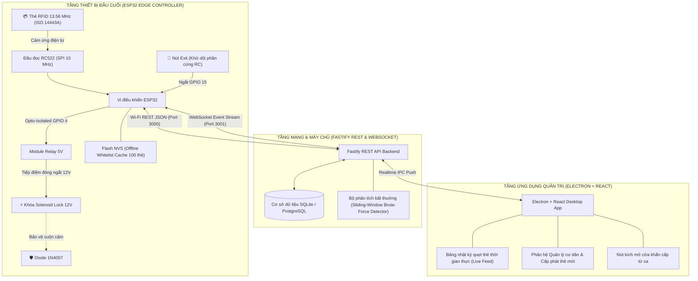
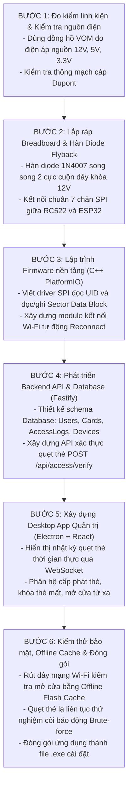
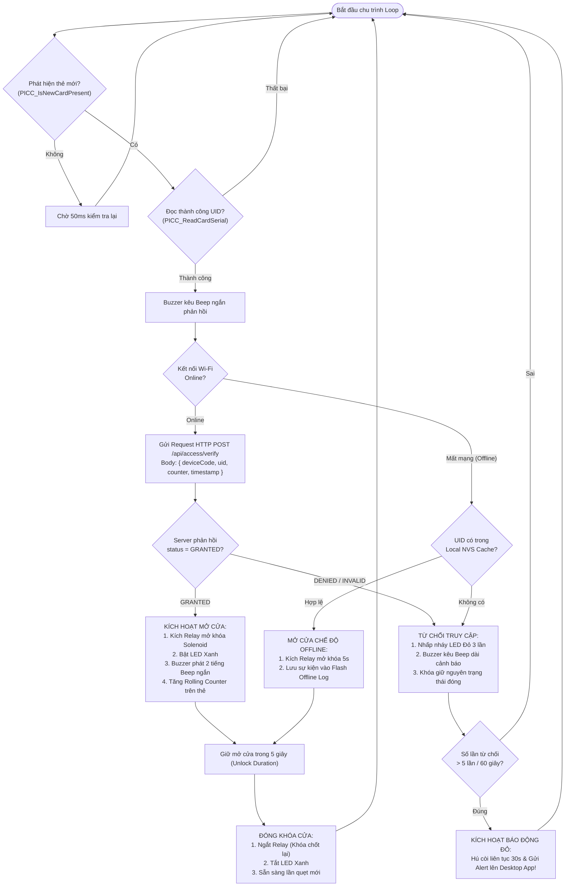
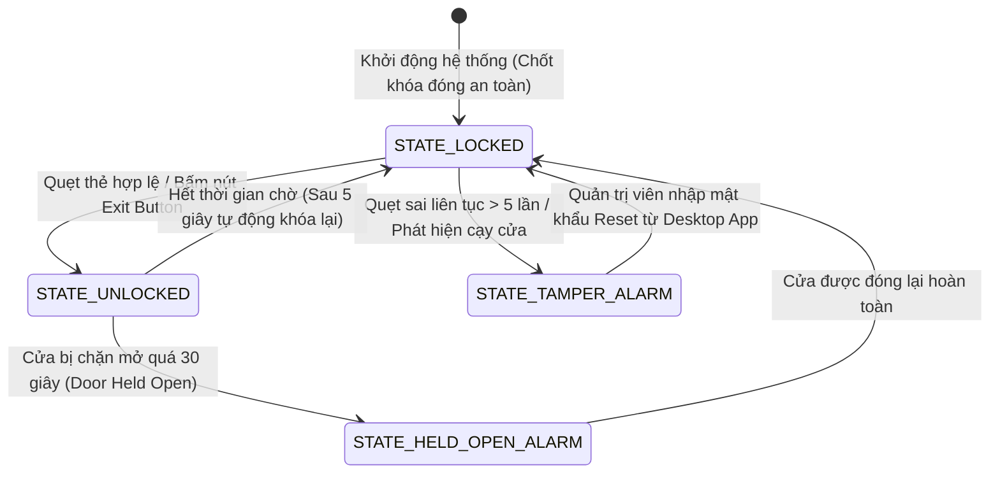

# 📘 SỔ TAY KỸ THUẬT CHUYÊN SÂU: SƠ ĐỒ KỸ THUẬT, SƠ ĐỒ QUY TRÌNH & CƠ SỞ LÝ THUYẾT
## Đề tài: Hệ thống kiểm soát cửa RFID & IoT tích hợp Desktop App (ESP32 + Fastify + Electron)

> **Tác giả:** Kỹ sư IoT & Hệ thống nhúng (NguyenHoangUy1305)  
> **Repository:** [NguyenHoangUy1305/iot-rfid-access-control](https://github.com/NguyenHoangUy1305/iot-rfid-access-control)  
> **Thời gian thực hiện:** Tháng 11/2026 - Tháng 01/2027 (Khởi động: 01/11/2026)  
> **Mục đích:** Cung cấp tài liệu kỹ thuật chuẩn công nghiệp bao gồm toàn bộ cơ sở lý thuyết điện từ, cấu trúc bộ nhớ vi mạch, nguyên lý chống xung ngược cảm ứng, sơ đồ đấu nối mạch chi tiết và sơ đồ luồng thuật toán vận hành của hệ thống kiểm soát cửa thông minh.

---

## MỤC LỤC
1. [PHẦN 1: CƠ SỞ LÝ THUYẾT & NGUYÊN LÝ HOẠT ĐỘNG CHUYÊN SÂU](#phần-1-cơ-sở-lý-thuyết--nguyên-lý-hoạt-động-chuyên-sâu)
   - 1.1 Sóng vô tuyến RFID 13.56 MHz & Tiêu chuẩn ISO/IEC 14443 Type A
   - 1.2 Nguyên lý cảm ứng điện từ Faraday & Cơ chế biến điệu tải (Load Modulation)
   - 1.3 Cấu trúc bộ nhớ vi mạch thẻ MIFARE Classic 1K & Bảng phân tích Access Bits
   - 1.4 Lỗ hổng Clone thẻ (Magic Card UID Gen 1/2) & Cơ chế bảo mật đa tầng
   - 1.5 Mạch công suất & Tải cảm ứng: Hiện tượng Back-EMF và Diode Flyback 1N4007
   - 1.6 Mạch cách ly quang Optocoupler PC817 chống nhiễu xuyên mass
   - 1.7 Hiện tượng dội phím cơ khí (Switch Contact Bounce) & Giải thuật Debounce
   - 1.8 Giao thức truyền thông vi điều khiển: Chuẩn SPI vs I2C vs Wiegand 26/34
   - 1.9 Kiến trúc mạng phân tán & Khả năng chịu lỗi ngoại tuyến (Offline Caching NVS)
2. [PHẦN 2: SƠ ĐỒ KỸ THUẬT & SƠ ĐỒ ĐẤU NỐI MẠCH (PINOUT)](#phần-2-sơ-đồ-kỹ-thuật--sơ-đồ-đấu-nối-mạch-pinout)
   - 2.1 Bảng ánh xạ chân GPIO chi tiết (Hardware Pinout Matrix)
   - 2.2 Sơ đồ nguyên lý mạch điện phần cứng (Hardware Schematics)
   - 2.3 Sơ đồ phân phối nguồn điện 2 tầng (Power Distribution & Buck Converter)
   - 2.4 Sơ đồ kiến trúc kỹ thuật toàn hệ thống (System Architecture Diagram)
3. [PHẦN 3: SƠ ĐỒ LÀM & SƠ ĐỒ QUY TRÌNH THỰC HIỆN DỰ ÁN](#phần-3-sơ-đồ-làm--sơ-đồ-quy-trình-thực-hiện-dự-án)
   - 3.1 Quy trình 6 bước triển khai thực chiến từ A-Z
   - 3.2 Sơ đồ thuật toán xử lý quẹt thẻ (Card Verification Flowchart)
   - 3.3 Sơ đồ máy trạng thái khóa cửa (Door State Machine)
   - 3.4 Sơ đồ tuần tự giao tiếp hệ thống (Sequence Diagram)

---

# PHẦN 1: CƠ SỞ LÝ THUYẾT & NGUYÊN LÝ HOẠT ĐỘNG CHUYÊN SÂU

### 1.1. Sóng vô tuyến RFID 13.56 MHz & Tiêu chuẩn ISO/IEC 14443 Type A
Hệ thống sử dụng sóng vô tuyến dải tần cao **High Frequency (HF) 13.56 MHz** tuân theo tiêu chuẩn quốc tế **ISO/IEC 14443 Type A** (tiêu chuẩn phổ biến nhất thế giới dùng trong thẻ ra vào tòa nhà, thẻ xe buýt Metro và thẻ căn cước thông minh).

* **Đặc tính sóng vô tuyến 13.56 MHz:**
  - Bước sóng trong không gian:
    $$\lambda = rac{c}{f_c} = rac{3 	imes 10^8 	ext{ m/s}}{13.56 	imes 10^6 	ext{ Hz}} pprox 22.12 	ext{ m}$$
  - Khoảng cách đọc của thẻ thụ động (Passive RFID Tag) nằm trong vùng trường gần (Near-Field Reactive Region), nơi khoảng cách $r$ nhỏ hơn nhiều so với bước sóng Rayleigh:
    $$r < rac{\lambda}{2\pi} pprox rac{22.12}{6.28} pprox 3.52 	ext{ m}$$
    Thực tế khoảng cách quẹt thẻ thẻ tiếp xúc danh định đạt từ **$1 \sim 4	ext{ cm}$**.

---

### 1.2. Nguyên lý cảm ứng điện từ Faraday & Cơ chế biến điệu tải (Load Modulation)

* **Hiện tượng nạp năng lượng cảm ứng (Inductive Coupling):**
  Cuộn anten trên mạch PCB của module đọc RC522 đóng vai trò là cuộn sơ cấp biến áp phát ra từ trường biến thiên $B(t)$ ở tần số $13.56	ext{ MHz}$. Khi thẻ RFID đi vào vùng từ trường này, cuộn dây phẳng gồm nhiều vòng bên trong thẻ đóng vai trò là cuộn thứ cấp hứng từ thông biến thiên $\Phi(t)$. Theo phương trình Maxwell-Faraday và định luật cảm ứng Neumann:
  $$e = -rac{d\Phi}{dt} = -N rac{d}{dt} \iint_S ec{B}(t) \cdot dec{A}$$
  Suất điện động cảm ứng $e$ được nắn dòng bởi mạch chỉnh lưu Diode Schottky tích hợp ngay bên trong chip thẻ và nạp vào tụ điện nội vi $C pprox 28	ext{ pF}$, tạo ra điện áp một chiều $V_{DD} pprox 2.5	ext{V} \sim 3.3	ext{V}$ cấp nguồn cho vi xử lý bên trong thẻ tự khởi động mà **hoàn toàn không cần pin nuôi** (Passive RFID Tag).

* **Cơ chế truyền dữ liệu ngược bằng Biến điệu tải (Load Modulation):**
  Thẻ RFID không có bộ phát sóng vô tuyến riêng. Để truyền dữ liệu ngược về đầu đọc RC522, vi xử lý trên thẻ đóng/ngắt một transistor tải điện trở song song với cuộn anten của chính nó theo nhịp bit dữ liệu.
  - Khi transistor bật: Cuộn dây thẻ tiêu thụ thêm năng lượng từ trường của đầu đọc.
  - Sự thay đổi dòng tiêu thụ này làm biến đổi nhẹ biên độ điện áp trên cuộn anten của đầu đọc RC522 (biến điệu biên độ ASK).
  - Tín hiệu phản hồi được truyền trên sóng mang phụ (**Subcarrier**) có tần số:
    $$f_s = rac{f_c}{16} = rac{13.56	ext{ MHz}}{16} = 848	ext{ kHz}$$
  - **Mã hóa tín hiệu:**
    - Chiều từ Đầu đọc $	o$ Thẻ: Sử dụng mã hóa **Modified Miller** với độ sâu điều chế $100\%$ ASK.
    - Chiều từ Thẻ $	o$ Đầu đọc: Sử dụng mã hóa **Manchester** đồng bộ xung nhịp subcarrier $848	ext{ kHz}$.

---

### 1.3. Cấu trúc bộ nhớ vi mạch thẻ MIFARE Classic 1K & Bảng phân tích Access Bits
Thẻ MIFARE Classic 1K (sản xuất bởi hãng NXP Semiconductors) có tổng dung lượng bộ nhớ là **1024 bytes (1 KB)** được phân chia cực kỳ chặt chẽ:
* Gồm **16 Sector** (Sector 0 đến Sector 15).
* Mỗi Sector gồm **4 Block** (Block 0 đến Block 3), mỗi Block chứa đúng **16 bytes** dữ liệu ($16 	imes 4 	imes 16 = 1024	ext{ bytes}$).

```text
+----------+---------+-------------------------------------------------------+
|  Sector  |  Block  | Chức năng & Nội dung chứa                             |
+----------+---------+-------------------------------------------------------+
| Sector 0 | Block 0 | Manufacturer Block: Chứa UID (4/7 bytes) & Dữ liệu SX  |
|          | Block 1 | Data Block 1 (Lưu mã sinh viên / mã căn hộ)          |
|          | Block 2 | Data Block 2 (Lưu mã Rolling Counter bảo mật)         |
|          | Block 3 | Sector Trailer 0: Key A (6B), Access Bits (4B), Key B |
+----------+---------+-------------------------------------------------------+
| Sector 1 | Block 0 | Data Block 4 (Block 0 của Sector 1)                   |
|          | Block 1 | Data Block 5                                          |
|          | Block 2 | Data Block 6                                          |
|          | Block 3 | Sector Trailer 1: Key A (6B), Access Bits (4B), Key B |
+----------+---------+-------------------------------------------------------+
| ...      | ...     | ...                                                   |
+----------+---------+-------------------------------------------------------+
| Sector 15| Block 0 | Data Block 60                                         |
|          | Block 1 | Data Block 61                                         |
|          | Block 2 | Data Block 62                                         |
|          | Block 3 | Sector Trailer 15: Key A (6B), Access Bits (4B), Key B|
+----------+---------+-------------------------------------------------------+
```

* **Chi tiết Sector 0 - Block 0 (Nhà sản xuất - Manufacturer Block):**
  - **Bytes 0 - 3 (hoặc 0 - 6):** Mã định danh duy nhất của thẻ (**UID - Unique Identifier**), ví dụ: `0x8A 0x3B 0x21 0xF0`.
  - **Byte 4:** Byte kiểm tra BCC (Block Check Character), tính bằng phép XOR liên tiếp:
    $$	ext{BCC} = 	ext{UID}_0 \oplus 	ext{UID}_1 \oplus 	ext{UID}_2 \oplus 	ext{UID}_3$$
  - **Byte 5:** Byte SAK (Select Acknowledge) báo cho đầu đọc biết loại vi mạch (SAK = `0x08` tương ứng thẻ MIFARE Classic 1K).
  - **Bytes 6 - 7:** Byte ATQA (Answer to Request acc. to ISO 14443A).
  - Ở thẻ NXP chính hãng, Block này được ghi cố định từ nhà máy và đặt ở trạng thái **Read-Only vĩnh viễn**, không có lệnh nào có thể sửa được.

* **Chi tiết Block 3 của mỗi Sector (Sector Trailer):**
  - **Bytes 0 - 5:** Khóa bảo mật `Key A` (6 bytes, ví dụ xuất xưởng: `0xFF 0xFF 0xFF 0xFF 0xFF 0xFF`).
  - **Bytes 6 - 9:** 4 bytes bit truy cập (`Access Bits`), mã hóa quyền đọc/ghi riêng biệt cho từng Block trong Sector.
  - **Bytes 10 - 15:** Khóa bảo mật `Key B` (6 bytes, dùng cho xác thực phân quyền 2 chiều).

* **Ma trận phân tích quyền truy cập (Access Bits Condition):**
  Mỗi Block được kiểm soát bởi 3 bit truy cập: $C_1, C_2, C_3$.
  - Cấu hình Transport mặc định ($C_1=0, C_2=0, C_3=0$): Cho phép đọc/ghi tự do dữ liệu bằng Key A hoặc Key B.
  - Cấu hình Read-Only ($C_1=1, C_2=1, C_3=0$): Chỉ cho phép đọc bằng Key A/B, cấm hoàn toàn lệnh ghi.
  - Cấu hình Value Block ($C_1=1, C_2=1, C_3=1$): Biến Block thành ví tiền điện tử, cho phép thực thi các lệnh nguyên tử phần cứng: `INCREMENT` (nạp tiền), `DECREMENT` (trừ tiền), `RESTORE` và `TRANSFER`.

---

### 1.4. Lỗ hổng Clone thẻ (Magic Card UID Gen 1/2) & Cơ chế bảo mật đa tầng

* **Bản chất kỹ thuật của vấn đề sao chép thẻ lậu:**
  Hiện nay trên thị trường tràn lan các loại phôi thẻ giá rẻ từ Trung Quốc ("Magic Card" UID Gen 1, CUID Gen 2, FUID, UFUID):
  - **Thẻ UID Gen 1:** Mở cửa sau phần cứng (Backdoor). Bằng cách gửi chuỗi lệnh đặc biệt `0x40` (7-bit) và `0x43`, đầu đọc cầm tay có thể ghi đè bất kỳ dữ liệu nào vào **Sector 0 Block 0**, biến chiếc thẻ trắng thành một bản sao y hệt thẻ cư dân chỉ trong 2 giây.
  - **Thẻ CUID Gen 2:** Không cần backdoor, cho phép ghi đè Sector 0 Block 0 bằng lệnh ghi dữ liệu chuẩn `0xA0` thông thường.
* **Tại sao chỉ dùng UID là LỖ HỔNG CHẾT NGƯỜI?**
  Nếu hệ thống chỉ đọc 4 bytes UID rồi gửi lên server mở cửa, bất kỳ ai có đầu đọc sao chép thẻ cầm tay mua 100k trên mạng đều có thể sao chép thẻ của người khác để đột nhập vào nhà!

* **Giải pháp phòng thủ đa tầng (Defense-in-Depth) của dự án:**
  1. **Tầng 1 - Không tin tưởng UID:** Đổi toàn bộ khóa `Key A` và `Key B` mặc định thành khóa bí mật riêng của dự án (ví dụ: `0xD3 0x9B 0x7E 0x41 0x2A 0x8F`).
  2. **Tầng 2 - Ghi Rolling Counter động vào Data Block:**
     - Tại **Block 1 của Sector 1**, hệ thống lưu trữ một số nguyên đếm số lần sử dụng (Counter) và một chữ ký số Hash SHA-256.
     - Mỗi lần quẹt thẻ thành công, ESP32 tăng Counter thêm 1, tính lại chữ ký và ghi ngược vào thẻ, đồng thời cập nhật Counter này lên Database của Server.
     - **Nguyên lý chống Clone:** Nếu kẻ gian sao chép thẻ tại thời điểm $	ext{Counter} = 10$. Khi thẻ gốc được sử dụng tiếp, trên Server số đếm đã tăng lên $	ext{Counter} = 15$. Khi kẻ gian mang thẻ clone ($	ext{Counter} = 10$) đi quẹt, Server phát hiện $	ext{Counter}_{	ext{clone}} < 	ext{Counter}_{	ext{server}}$, lập tức khóa cửa, phát chuông báo động đỏ và gửi cảnh báo về điện thoại quản trị viên!
  3. **Tầng 3 - Thuật toán phát hiện quét thẻ bất thường (Brute-Force Anomaly Detection):**
     Nếu một đầu đọc ghi nhận liên tiếp $> 5$ lần quẹt thẻ không hợp lệ trong vòng $60	ext{ giây}$, hệ thống tự động khóa cổng đọc trong $3	ext{ phút}$ và gửi thông báo khẩn cấp lên Dashboard Desktop.

---

### 1.5. Mạch công suất & Tải cảm ứng: Hiện tượng Back-EMF và Diode Flyback 1N4007
Khóa chốt điện Solenoid Lock 12V hoạt động dựa trên một cuộn dây đồng quấn quanh một lõi sắt di động. Dòng điện chạy qua tạo ra lực từ trường hút thanh chốt thụt vào trong để mở cửa.

* **Bản chất tải cảm kháng:**
  Cuộn dây khóa là một **tải thuần cảm** có độ tự cảm $L pprox 50 \sim 150	ext{ mH}$ và điện trở nội $R pprox 8\Omega$. Khi đóng nguồn 12V, dòng điện kéo qua cuộn dây đạt:
  $$I = rac{U}{R} = rac{12	ext{V}}{8\Omega} = 1.5	ext{ A}$$
  Năng lượng tích lũy trong từ trường của cuộn dây là:
  $$E = rac{1}{2} L I^2 = rac{1}{2} 	imes 0.1 	imes (1.5)^2 = 0.1125	ext{ Joules}$$

* **Hiện tượng Sức điện động cảm ứng ngược (Back-EMF / Inductive Kick):**
  Khi tiếp điểm Relay ngắt điện, dòng điện $I$ bị cưỡng bức giảm từ $1.5	ext{ A}$ về $0	ext{ A}$ trong một khoảng thời gian cực ngắn của hồ quang điện ($dt pprox 1 \sim 5\mu	ext{s}$). Theo định luật cảm ứng tự cảm của Faraday và định luật Lenz:
  $$V_{	ext{kick}} = -L rac{di}{dt}$$
  Vì $rac{di}{dt} = rac{-1.5	ext{ A}}{5 	imes 10^{-6}	ext{ s}} = -300.000	ext{ A/s}$, điện áp ngược sinh ra trên 2 đầu cuộn dây vọt lên:
  $$V_{	ext{kick}} = -(0.1	ext{ H}) 	imes (-300.000	ext{ A/s}) = +300	ext{ V}!$$
  Điện áp xung nhọn $300	ext{V}$ này sinh ra tia lửa điện đánh cháy tiếp điểm cơ khí của Relay, phát ra bức xạ điện từ mạnh (EMI) truyền ngược qua đường mass, làm sụt áp nguồn 3.3V của ESP32 khiến vi điều khiển bị khởi động lại liên tục (**Brownout Reset**), hoặc đánh thủng transistor điều khiển!

* **Nguyên lý bảo vệ của Diode Flyback (Freewheeling Diode 1N4007):**
  - Mắc một Diode chỉnh lưu 1N4007 **song song ngược cực tính** với nguồn nuôi cuộn dây khóa (Cathode nối vào cực $+12	ext{V}$, Anode nối vào cực âm/Relay).
  - Khi có điện 12V: Diode bị phân cực ngược, không có dòng rò chạy qua Diode.
  - Khi Relay ngắt điện: Điện áp cảm ứng ngược sinh ra có cực tính ngược lại (+ ở dưới, - ở trên). Lúc này Diode Flyback lập tức được **phân cực thuận**, tạo thành một mạch vòng kín (Closed Circuit) cho dòng điện cảm ứng tiếp tục tự tuần hoàn qua Diode.
  - Toàn bộ năng lượng từ trường $rac{1}{2}LI^2$ được tiêu tán an toàn dưới dạng nhiệt trên điện trở nội của cuộn dây, triệt tiêu hoàn toàn xung áp nhọn, giữ cho điện áp luôn bị ghim ở mức an toàn $V_{clamp} = 12	ext{V} + 0.7	ext{V} = 12.7	ext{V}$.

---

### 1.6. Mạch cách ly quang Optocoupler PC817 chống nhiễu xuyên mass
Module Relay 5V được trang bị IC cách ly quang **Optocoupler PC817**:
* Bên trong PC817 gồm một Diode phát quang hồng ngoại (IR LED) ở phía đầu vào và một Transistor quang (Phototransistor) ở phía đầu ra, ngăn cách nhau bởi một lớp điện môi trong suốt có khả năng cách điện lên tới $5000	ext{ Vrms}$.
* Tín hiệu kích từ chân GPIO 4 của ESP32 ($3.3	ext{V}$) chỉ nuôi sáng LED hồng ngoại. Ánh sáng này kích mở Transistor để kéo dòng mở cuộn hút Relay ở mạch công suất 5V/12V.
* **Tác dụng kỹ thuật:** Tách biệt hoàn toàn đường mass tín hiệu số (`Digital GND`) của ESP32 với đường mass công suất (`Power GND`) của Relay và khóa từ, ngăn chặn tuyệt đối các xung nhiễu công nghiệp truyền ngược vào vi điều khiển.

---

### 1.7. Hiện tượng dội phím cơ khí (Switch Contact Bounce) & Giải thuật Debounce
Nút bấm Exit Button (mở cửa từ bên trong) sử dụng tiếp điểm kim loại đàn hồi.

* **Bản chất dội phím:**
  Khi người dùng nhấn hoặc nhả nút bấm, hai thanh kim loại không tiếp xúc êm ái mà va chạm nảy qua nảy lại nhiều lần trong khoảng thời gian $5	ext{ ms} \sim 20	ext{ ms}$ trước khi giữ chặt. Điều này làm cho chân GPIO 15 của ESP32 ghi nhận hàng chục xung sườn lên và sườn xuống liên tiếp, dẫn đến hiện tượng cửa mở rồi đóng ngắt loạn xạ hoặc kích hoạt sai còi báo động.
* **Giải pháp lọc dội 2 tầng:**
  1. **Lọc dội phần cứng (Hardware RC Filter):** Mắc một tụ điện gốm $C = 100	ext{ nF}$ song song với nút nhấn kết hợp với điện trở kéo lên $R = 10	ext{ k}\Omega$. Hằng số thời gian mạch nạp:
     $$	au = R 	imes C = 10^4\Omega 	imes 10^{-7}	ext{F} = 10^{-3}	ext{ s} = 1	ext{ ms}$$
     Mạch lọc thông thấp này sẽ triệt tiêu hoàn toàn các gai xung nhọn tần số cao do tiếp điểm cơ khí nảy sinh ra.
  2. **Lọc dội phần mềm không chặn (Non-blocking Software Debounce):**
     Tuyệt đối không dùng hàm `delay(50)`. Sử dụng kỹ thuật lưu vết thời gian với `millis()`:
     ```cpp
     int reading = digitalRead(PIN_EXIT_BTN);
     if (reading != lastButtonState) {
         lastDebounceTime = millis();
     }
     if ((millis() - lastDebounceTime) > DEBOUNCE_DELAY_MS) { // 50ms
         if (reading != buttonState) {
             buttonState = reading;
             if (buttonState == LOW) {
                 triggerDoorUnlock(REASON_EXIT_BUTTON);
             }
         }
     }
     lastButtonState = reading;
     ```

---

### 1.8. Giao thức truyền thông vi điều khiển: Chuẩn SPI vs I2C vs Wiegand 26/34

| Tiêu chí kỹ thuật | Chuẩn SPI (Được chọn cho RC522) | Chuẩn I2C | Chuẩn Wiegand 26/34 (Công nghiệp) |
| :--- | :--- | :--- | :--- |
| **Số lượng dây dẫn** | **4 dây** (`SCK`, `MOSI`, `MISO`, `SS`) | 2 dây (`SDA`, `SCL`) | 2 dây (`DATA0`, `DATA1`) |
| **Tốc độ truyền xung nhịp** | **Cực cao (Lên tới $10	ext{ MHz}$)** | Trung bình ($100	ext{ kHz} \sim 400	ext{ kHz}$) | Cực chậm ($10	ext{ kHz}$) |
| **Độ trễ đọc thẻ** | **$< 10	ext{ ms}$ (Tức thì)** | $40 \sim 80	ext{ ms}$ | $50 \sim 100	ext{ ms}$ |
| **Kiểu truyền thông** | Song công toàn phần (Full-Duplex) | Bán song công (Half-Duplex) | Đơn công 1 chiều (Simplex) |
| **Khả năng chống nhiễu** | Rất tốt trong khoảng cách ngắn ($< 20	ext{ cm}$) | Nhạy cảm với điện dung ký sinh | Cực tốt trong khoảng cách xa ($> 100	ext{ m}$) |
| **Đánh giá ứng dụng** | **Tối ưu nhất cho mô hình tích hợp gần** | Dễ nghẽn khi đọc thẻ nhanh | Chuẩn cho đầu đọc gắn ngoài trời kéo dây xa |

---

### 1.9. Kiến trúc mạng phân tán & Khả năng chịu lỗi ngoại tuyến (Offline Caching NVS)
Hệ thống được thiết kế với tiêu chuẩn không phụ thuộc đơn điểm (No Single Point of Failure):

```text
                     +---------------------------------------+
                     |         KIẾN TRÚC XỬ LÝ 2 CHẾ ĐỘ      |
                     +---------------------------------------+
                                         │
                                [QUẸT THẺ RFID]
                                         │
                             [Kiểm tra kết nối mạng?]
                                  /                                    (Online)  /               \  (Offline / Timeout)
                                ▼                 ▼
                    +--------------------+   +--------------------+
                    |  GỬI HTTP REST API |   | TRA CỨU FLASH NVS  |
                    | POST /api/access   |   | Bảng Hash 100 thẻ  |
                    +--------------------+   +--------------------+
                                │                         │
                       [Server phản hồi]             [Có trong Cache?]
                                │                         │
                        +---------------+         +---------------+
                        | GRANTED/DENIED|         |  MỞ CỬA OFFLINE|
                        | Lưu log DB    |         | Lưu Queue RAM |
                        +---------------+         +---------------+
```

* **Bộ nhớ NVS (Non-Volatile Storage):** ESP32 sử dụng một phân vùng bộ nhớ Flash chuyên dụng để lưu trữ các cặp Key-Value. Khi hệ thống Online, mỗi khi có cư dân mới hoặc cập nhật thẻ, Server sẽ tự động đồng bộ danh sách thẻ hợp lệ về lưu trong NVS.
* **Cơ chế Fallback thông minh:** Khi ESP32 gửi HTTP request xác thực mà không nhận được phản hồi sau $1.5	ext{ giây}$ (timeout), vi điều khiển không từ chối người dùng mà tự động kích hoạt **Offline Engine**: Tra cứu mã băm của thẻ trong NVS. Nếu hợp lệ, Relay vẫn kích mở khóa bình thường và ghi lại sự kiện vào hàng đợi ngoại tuyến `offline_queue`.
* **Tự động đồng bộ ngược:** Ngay khi Wi-Fi có trở lại, một Task chạy ngầm sẽ tự động đọc `offline_queue` và gửi bù toàn bộ lịch sử quẹt thẻ ngoại tuyến lên Server để ghi vào Database.

---

# PHẦN 2: SƠ ĐỒ KỸ THUẬT & SƠ ĐỒ ĐẤU NỐI MẠCH (PINOUT)

### 2.1. Bảng ánh xạ chân GPIO chi tiết (Hardware Pinout Matrix)

| Thiết bị ngoại vi | Chân Module | Chân kết nối ESP32 | Mức điện áp | Ghi chú an toàn phần cứng |
| :--- | :--- | :--- | :--- | :--- |
| **RFID-RC522** | **3.3V** | **3V3 (ESP32)** | 3.3V DC | ⚠️ **CẤM CẮM 5V** (Cháy module MFRC522 lập tức!) |
| | **GND** | **GND** | 0V | Nối mass chung toàn mạch |
| | **RST** | **GPIO 22** | 3.3V Logic | Chân Reset phần cứng của RC522 |
| | **MISO** | **GPIO 19** | 3.3V Logic | SPI Master In Slave Out |
| | **MOSI** | **GPIO 23** | 3.3V Logic | SPI Master Out Slave In |
| | **SCK** | **GPIO 18** | 3.3V Logic | SPI Serial Clock ($10	ext{ MHz}$) |
| | **SDA (SS)** | **GPIO 5** | 3.3V Logic | SPI Chip Select (Active LOW) |
| **Relay 5V Module** | **VCC** | **VIN (hoặc 5V)** | 5V DC | Cấp nguồn nuôi cuộn hút relay |
| | **GND** | **GND** | 0V | Nối mass chung |
| | **IN** | **GPIO 4** | 3.3V Logic | Kích mở Relay qua Optocoupler PC817 |
| **Còi Active Buzzer**| **VCC (+)** | **GPIO 2** | 3.3V Logic | Còi chíp 3.3V phát âm thanh phản hồi |
| | **GND (-)** | **GND** | 0V | Mass chung |
| **LED Xanh (Thành công)**|**Anode (+)**| **GPIO 16** | 3.3V qua $220\Omega$ | Đèn báo xác thực thẻ hợp lệ |
| **LED Đỏ (Từ chối)** | **Anode (+)** | **GPIO 17** | 3.3V qua $220\Omega$ | Đèn báo từ chối thẻ / Cảnh báo an ninh |
| **Nút Nhấn Exit Button**|**Chân 1** | **GPIO 15** | PULLUP nội | Nút bấm cơ mở cửa từ bên trong |
| | **Chân 2** | **GND** | 0V | Nối mass khi nhấn nút |
| **Khóa Chốt Solenoid**| **Dây (+)** | **Nguồn +12V DC**| 12V DC (1.5A)| Nguồn Adapter 12V 2A rời |
| | **Dây (-)** | **Relay NO** | Tiếp điểm | Chân COM của Relay nối về Mass 12V |
| **Diode Flyback** | **Cathode** | **Khóa (+12V)** | Phân cực ngược | Vạch trắng nối vào nguồn dương 12V |
| | **Anode** | **Khóa (Dây -)** | Phân cực ngược | Mắc song song trực tiếp tại 2 cọc cuộn dây khóa |

---

### 2.2. Sơ đồ nguyên lý mạch điện phần cứng (Hardware Schematics)

```text
       +-------------------------------------------------------------+
       |               SƠ ĐỒ ĐẤU NỐI MẠCH PHẦN CỨNG CHI TIẾT          |
       +-------------------------------------------------------------+

      [NGUỒN 12V DC 2A]
         │        │
         │ (+)    └──(GND)───────────────────────────────┐
         │                                               │
         ├───[Buck LM2596: 12V -> 5V]───(+) 5V──>[VIN]   │
         │                                  │    [ESP32] │
         │   ┌──────────────────────────────┴───>[GND]───┤ (Mass chung)
         │   │                                           │
         │   │   +-------------------------+             │
         │   │   |    ESP32 DEVKIT V1      |             │
         │   │   |                         |             │
         │   │   | 3V3 ─────────────────(3.3V) RFID RC522│
         │   │   | GND ─────────────────(GND)            │
         │   │   | GPIO 5 (SS)──────────(SDA)            │
         │   │   | GPIO 18 (SCK)────────(SCK)            │
         │   │   | GPIO 23 (MOSI)───────(MOSI)           │
         │   │   | GPIO 19 (MISO)───────(MISO)           │
         │   │   | GPIO 22 (RST)────────(RST)            │
         │   │   |                         |             │
         │   │   | GPIO 4 ──────────────(IN) RELAY 5V    │
         │   └───| 5V/VIN ──────────────(VCC) MODULE     │
         │       | GND ─────────────────(GND)            │
         │       |                         |             │
         │       | GPIO 2 ──────────────(+) ACTIVE BUZZER│
         │       | GPIO 16 ──[220Ω]─────(+) LED XANH     │
         │       | GPIO 17 ──[220Ω]─────(+) LED ĐỎ       │
         │       | GPIO 15 ─────────────[NÚT NHẤN EXIT]──┤
         │       +-------------------------+             │
         │                                               │
         ├───(+)12V────────┐                             │
         │                 │                             │
         │           [KHÓA TỪ 12V]                       │
         │            ▲         │                        │
         │     1N4007 │         │                        │
         │     Diode  │         ▼                        │
         │            └───(NO) RELAY (COM)───────────────┘
         │
         └───────────────────────────────────────────────────────────
```

---

### 2.3. Sơ đồ phân phối nguồn điện 2 tầng (Power Distribution & Buck Converter)


---

### 2.4. Sơ đồ kiến trúc kỹ thuật toàn hệ thống (System Architecture Diagram)



---

# PHẦN 3: SƠ ĐỒ LÀM & SƠ ĐỒ QUY TRÌNH THỰC HIỆN DỰ ÁN

### 3.1. Quy trình 6 bước triển khai thực chiến từ A-Z



---

### 3.2. Sơ đồ thuật toán xử lý quẹt thẻ (Card Verification Flowchart)



---

### 3.3. Sơ đồ máy trạng thái khóa cửa (Door State Machine)



---

### 3.4. Sơ đồ tuần tự giao tiếp hệ thống (Sequence Diagram)

```mermaid
sequenceDiagram
    autonumber
    actor Resident as Cư dân
    participant RC522 as Đầu đọc RC522
    participant ESP32 as Vi điều khiển ESP32
    participant Relay as Khóa Solenoid (Relay)
    participant Server as Fastify Backend
    participant DB as SQLite Database
    participant Desktop as Electron Desktop App

    Resident->>RC522: Đưa thẻ RFID vào vùng đọc (1-4cm)
    RC522->>ESP32: Bắn ngắt SPI truyền mã UID + Data Block
    ESP32->>ESP32: Bật Buzzer Beep ngắn phản hồi

    alt Kết nối mạng Online
        ESP32->>Server: POST /api/access/verify { uid: "8A3B21F0", deviceId: "DOOR_01" }
        Server->>DB: Query bảng Cards & Residents (Check status & permissions)
        DB-->>Server: Trả về kết quả { valid: true, residentName: "Nguyen Van A" }
        Server->>DB: INSERT INTO AccessLogs (uid, status, timestamp)
        Server-->>ESP32: HTTP 200 { status: "GRANTED", duration: 5000 }
        Server-->>Desktop: WebSocket Push Event: { newLog: "Cửa 1 mở bởi Nguyen Van A" }
        ESP32->>Relay: Kích chân GPIO 4 mở Relay (Chốt khóa mở)
        ESP32->>ESP32: Bật LED Xanh & 2 tiếng Beep
        Note over ESP32,Relay: Giữ mở trong 5000ms
        ESP32->>Relay: Ngắt chân GPIO 4 (Chốt khóa đóng lại an toàn)
    else Mất kết nối mạng (Offline Fallback)
        ESP32->>ESP32: Tra cứu danh sách thẻ trong bộ nhớ Flash NVS
        alt Thẻ có trong NVS
            ESP32->>Relay: Kích chân GPIO mở Relay
            ESP32->>ESP32: Lưu bản ghi sự kiện vào Flash Offline Queue
        else Thẻ lạ không có trong NVS
            ESP32->>ESP32: Nhấp nháy LED Đỏ & Còi Beep dài từ chối
        end
    end
