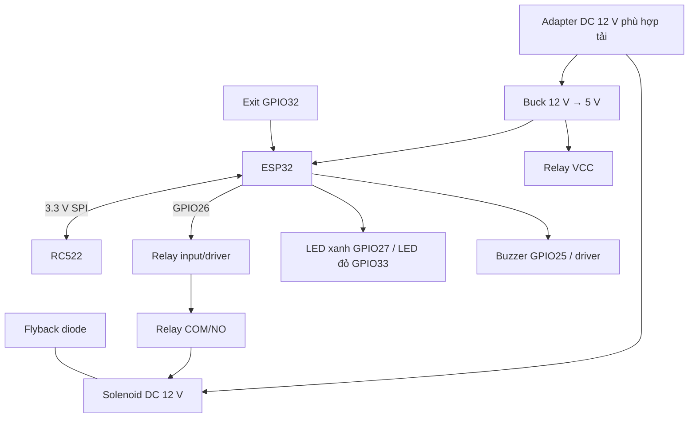
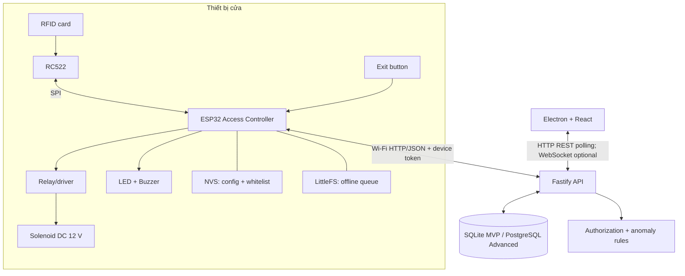
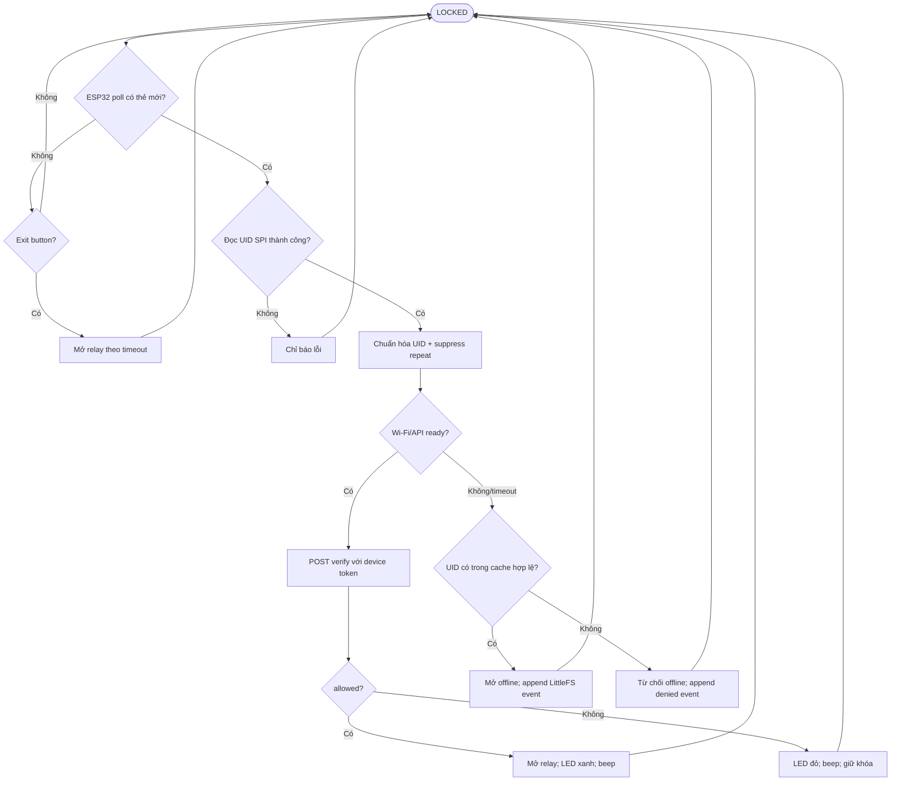
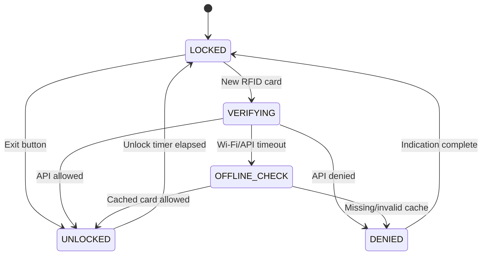

# 📘 SỔ TAY KỸ THUẬT CHUYÊN SÂU — BẢN CHỐT v1.1
## Sơ đồ kỹ thuật, quy trình và cơ sở lý thuyết
### Hệ thống kiểm soát cửa RFID & IoT: ESP32 + RC522 + Fastify + Electron

> **Tác giả:** NguyenHoangUy1305  
> **Repository:** `NguyenHoangUy1305/iot-rfid-access-control`  
> **Phiên bản:** 1.1 — MVP và hướng nâng cấp  
> **Phạm vi an toàn:** Chỉ mô hình DC điện áp thấp 3.3 V / 5 V / 12 V; không đấu điện lưới 220 V.

---

## 1. Mục tiêu và giới hạn

### 1.1 Mục tiêu MVP

```text
RFID card → RC522/SPI → ESP32 → Fastify API → Database
                                   ↓
                           Relay + LED + Buzzer

Electron + React → Fastify REST API → quản lý cư dân/thẻ/log/alert
```

MVP gồm đọc UID, server-side authorization, device token, card lifecycle, quyền theo cửa, audit log, anomaly rules, Electron CRUD, whitelist offline và idempotent event sync.

### 1.2 Giới hạn bảo mật

- UID là định danh kỹ thuật; không phải bí mật.
- MIFARE Classic/RC522 không được tuyên bố chống clone tuyệt đối.
- Bảo mật MVP dựa vào device token, trạng thái card phía server, permission theo cửa, audit log, offline policy và alert rules.
- Access log trong MVP là audit record để truy vết; không tuyên bố immutable/non-repudiation nếu chưa có append-only database policy, chữ ký số hoặc hash chain.
- Counter trong card là Advanced Feature; chỉ hỗ trợ phát hiện dữ liệu cũ/rollback trong một số tình huống.

---

## 2. Cơ sở lý thuyết

### 2.1 RFID HF 13.56 MHz

MFRC522 là frontend RFID/NFC HF 13.56 MHz dùng với ISO/IEC 14443 A/MIFARE. Reader và thẻ passive ghép cảm ứng qua anten cuộn dây trong vùng gần.

$$\lambda = rac{c}{f} = rac{3	imes10^8}{13.56	imes10^6} pprox 22.12	ext{ m}$$

Ranh giới vùng gần theo mô hình anten không phải khoảng cách đọc card. Khoảng cách đọc RC522 phụ thuộc loại thẻ, anten, nguồn 3.3 V, dây SPI, vật kim loại và môi trường. Dự án phải đo trên hardware thật; không coi 1–4 cm là thông số đảm bảo cho mọi module.

### 2.2 Cấp nguồn passive card

Từ trường biến thiên tạo điện áp cảm ứng trên anten card:

$$e = -Nrac{d\Phi}{dt}$$

Mạch nội card chỉnh lưu năng lượng này để cấp nguồn tạm thời cho IC. Giá trị điện dung hoặc điện áp nội cụ thể phụ thuộc chip/thẻ; không dùng một giá trị chung cho mọi card.

### 2.3 Load modulation

Card passive thay đổi tải hiệu dụng trên anten để tạo thay đổi nhỏ reader có thể nhận biết. Điều chế/coding chi tiết phụ thuộc ISO/IEC 14443 A và tốc độ giao tiếp; chúng không phải tiêu chí hiệu năng bắt buộc của MVP.

### 2.4 MIFARE Classic 1K

```text
1024 byte; 16 sector; mỗi sector 4 block; mỗi block 16 byte.
Block 3 mỗi sector là Sector Trailer.
```

| Thành phần | Kích thước | Vai trò |
|---|---:|---|
| Data block | 16 byte | Dữ liệu ứng dụng |
| Key A | 6 byte | Khóa xác thực sector |
| Access bits | 3 byte + byte kiểm tra | Quyền truy cập block |
| Key B | 6 byte | Khóa phụ tùy cấu hình |

Sector 0 Block 0 là Manufacturer Block. Tùy loại UID, nó chứa UID, byte kiểm tra liên quan và dữ liệu manufacturer. ATQA/SAK là thông tin trao đổi trong anti-collision/select, không phải dữ liệu cố định cần mô tả như byte ứng dụng trong block. MVP chỉ đọc UID để tra server; không yêu cầu đọc/ghi sector hoặc Key A/Key B.

### 2.5 Tải DC cảm và flyback diode

Solenoid DC là tải điện trở–cảm kháng. Mô hình lý thuyết:

$$E=rac{1}{2}LI^2$$

$$V_L=-Lrac{di}{dt}$$

Khi relay ngắt, cuộn cảm tạo điện áp ngược; biên độ thực phụ thuộc solenoid, dòng, wiring và phần tử bảo vệ. Không dùng một giá trị dòng, độ tự cảm hay xung áp cố định cho mọi khóa.

Flyback diode mắc ngược song song solenoid:

```text
Cathode/vạch trắng → Solenoid (+)
Anode              → Solenoid (−)
```

Khi relay ngắt, diode dẫn và tạo vòng hồi dòng. Nó giới hạn điện áp ngược trên cuộn dây gần điện áp dẫn thuận diode, thường khoảng 0.7–1.1 V tùy diode và dòng tải; không dùng công thức cố định `12 V + 0.7 V` cho điện áp trên cuộn dây. Flyback diode giảm xung/EMI nhưng có thể làm solenoid nhả chậm hơn. Chọn diode theo datasheet hoặc dòng tải đo thực.

### 2.6 Relay module và optocoupler

Optocoupler PC817 trên một số relay module có thể giảm ảnh hưởng nhiễu lên input logic, nhưng không tự động tạo cách ly galvanic hoàn toàn. Mức cách ly tùy thiết kế VCC/JD-VCC, jumper, GND, nguồn coil và mạch input của module.

Nếu chưa có schematic/datasheet đúng module, dùng chung GND là thiết kế bình thường cho MVP; tập trung vào diode flyback, nguồn đủ dòng, tụ lọc và routing dây. Không khẳng định “rút jumper là luôn cách ly hoàn toàn”.

### 2.7 Debounce exit button

- Dùng `millis()` debounce 30–50 ms, không dùng `delay()`.
- Tụ 100 nF có thể hỗ trợ lọc nhiễu nhanh.
- Nếu tính RC với 10 kΩ và 100 nF thì cần điện trở ngoài 10 kΩ:

$$	au=RC=10\,000	imes100	imes10^{-9}=1	ext{ ms}$$

RC 1 ms không thay thế software debounce. Pull-up nội ESP32 không được giả định là đúng 10 kΩ.

### 2.8 Lưu trữ flash

| Storage | Dùng cho | Không dùng cho |
|---|---|---|
| NVS/Preferences | Device config, cache version, whitelist nhỏ | Access log ghi liên tục |
| LittleFS | Offline event queue | Bí mật plaintext không bảo vệ |

CRC32 dùng phát hiện lỗi dữ liệu ngẫu nhiên hoặc cache ghi không hoàn chỉnh. CRC32 không phải encryption và không phải authentication.

---

## 3. Sơ đồ kỹ thuật và hardware

### 3.1 Pinout

Pinout này giảm nguy cơ boot conflict; nó không loại trừ tuyệt đối lỗi boot. Cần test trên board, relay và nguồn thật.

| Thiết bị | Chân | ESP32 | Ghi chú |
|---|---|---:|---|
| RC522 | VCC/GND | 3V3/GND | Chỉ cấp 3.3 V trừ khi datasheet module xác nhận khác |
| RC522 | SS/SCK/MOSI/MISO/RST | 21/18/23/19/22 | SPI |
| Relay | IN | GPIO26 | Test active-low/high và logic 3.3 V |
| Buzzer | Signal | GPIO25 | Chỉ direct nếu 3.3 V dòng thấp; nếu không dùng driver |
| LED xanh | Anode | GPIO27 + 220–330 Ω | Cathode GND |
| LED đỏ | Anode | GPIO33 + 220–330 Ω | Cathode GND |
| Exit | Chân 1/2 | GPIO32/GND | `INPUT_PULLUP`, active-low |

Tránh dùng GPIO0, 2, 4, 5, 12 và 15 cho relay/buzzer/button nếu chưa hiểu ảnh hưởng strapping trên board cụ thể.

### 3.2 Khởi tạo relay

Với relay active-low, cần kiểm thử boot/reset thật. Ví dụ Arduino:

```cpp
constexpr uint8_t PIN_RELAY = 26;
constexpr uint8_t RELAY_OFF = HIGH;

digitalWrite(PIN_RELAY, RELAY_OFF);
pinMode(PIN_RELAY, OUTPUT);
```

Đây là biện pháp giảm xung khởi động, không thay thế kiểm thử phần cứng hoặc điện trở pull-up/driver phù hợp.

### 3.3 Wiring high-side solenoid

Topology dưới đây giả định khóa **fail-secure**: cấp điện để nhả chốt; mất điện giữ khóa. Phải xác nhận loại khóa thực tế. Maglock fail-safe cần logic/tiếp điểm khác và phải xét yêu cầu PCCC.

```text
+12 V adapter → Relay COM → Relay NO → Solenoid (+)
Solenoid (−) → GND adapter

Flyback diode trực tiếp tại solenoid:
Cathode → Solenoid (+)
Anode   → Solenoid (−)
```

Adapter 12 V chọn theo datasheet hoặc dòng đo cực đại của khóa, cộng dự phòng phù hợp; không mặc định mọi solenoid cần 2 A.

### 3.4 Hardware block diagram



### 3.5 System architecture



Electron IPC chỉ nằm giữa Electron Main Process và Renderer Process; IPC không phải giao thức giữa Electron và Fastify.

---

## 4. Luồng phần mềm

### 4.1 Data model

```text
Door: id, code, name, location, active
Device: id, deviceCode, doorId, tokenHash, active, lastSeenAt, firmwareVersion
Card: id, uid, residentId, status, expiresAt
CardDoorPermission: cardId, doorId, isAllowed, validFrom, validUntil
AccessLog: eventId, receivedAt, deviceEventAt, result, reasonCode
SecurityAlert: ruleCode, severity, status, createdAt, resolvedAt
```

Một Device thuộc một Door trong MVP. ESP32 gửi `deviceCode`; server tìm Device rồi suy ra Door, không tin `doorId` do client tùy ý khai báo.

### 4.2 API MVP

```http
POST /api/device/access/verify
X-Device-Token: <raw-device-token>
Content-Type: application/json

{
  "deviceCode": "DOOR_MAIN_01",
  "uid": "a43c9b10",
  "deviceEventAt": "2026-12-09T08:30:00+07:00",
  "timeSynced": true
}
```

```json
{
  "allowed": true,
  "reasonCode": "ACCESS_GRANTED",
  "unlockDurationMs": 3000,
  "alarm": false,
  "serverTime": "2026-12-09T08:30:00+07:00"
}
```

Database chỉ lưu `tokenHash`; raw device token chỉ nằm trong secret/config không commit Git. Nonce/HMAC replay protection là Advanced Feature trừ khi có thiết kế hoàn chỉnh nonce TTL và request signing.

### 4.3 Flowchart



ESP32 poll RC522 qua SPI; RC522 không tự push UID trong MVP nếu không dùng IRQ/interrupt riêng.

### 4.4 State machine



Door-held-open/tamper state chỉ thêm khi có reed switch/tamper hardware.

### 4.5 Offline policy

```text
Offline GRANT:
- UID nằm trong cache version hợp lệ.
- Card ACTIVE và được phép tại cửa ở lần sync gần nhất.

Offline DENY:
- UID không cache.
- Enrollment/revoke/permission update mới chưa sync.
- Remote unlock.
```

Event queue gồm `eventId`, `deviceCode`, `uid`, `deviceEventAt`, `timeSynced`, `result`. Server dùng `eventId` unique để sync idempotent. `receivedAt` của server là thời gian audit chính; device time chỉ mang tính tham khảo.

### 4.6 Anomaly rules MVP

| Rule | Điều kiện | Kết quả |
|---|---|---|
| RULE_01 | 3 `CARD_NOT_FOUND` trong 60 giây tại cùng cửa | Warning |
| RULE_02 | 5 `DENIED` tổng cộng trong 60 giây tại cùng cửa | High alert |
| RULE_03 | Card BLOCKED/REVOKED được quẹt | Security alert |
| RULE_04 | Device token sai 3 lần trong 5 phút | Device security alert |

HTTP request-response MVP chỉ cho phép server trả `alarm:true` trên response hiện tại. Push command để server chủ động khóa reader cần MQTT, WebSocket hoặc command polling riêng; đó là Advanced Feature.

### 4.7 Electron security

```text
contextIsolation: true
nodeIntegration: false
preload/contextBridge expose API tối thiểu
Renderer gọi Fastify qua REST
IPC chỉ dùng Electron Main ↔ Renderer
```

---

## 5. Tài liệu tham khảo

1. NXP Semiconductors, *MFRC522 Standard Performance MIFARE and NTAG Frontend*.
2. Miguel Balboa, *MFRC522 Arduino RFID Library*.
3. F. D. Garcia et al., *Dismantling MIFARE Classic*, ESORICS 2008.
4. NIST SP 800-98, *Guidelines for Securing RFID Systems*.
5. Espressif, ESP32 GPIO/strapping and programming documentation.
6. Fastify TypeScript documentation.
7. Prisma SQLite/migrations documentation.
8. Electron security/context isolation documentation.
9. OWASP API Security Top 10 and IoT Security Verification Standard.
