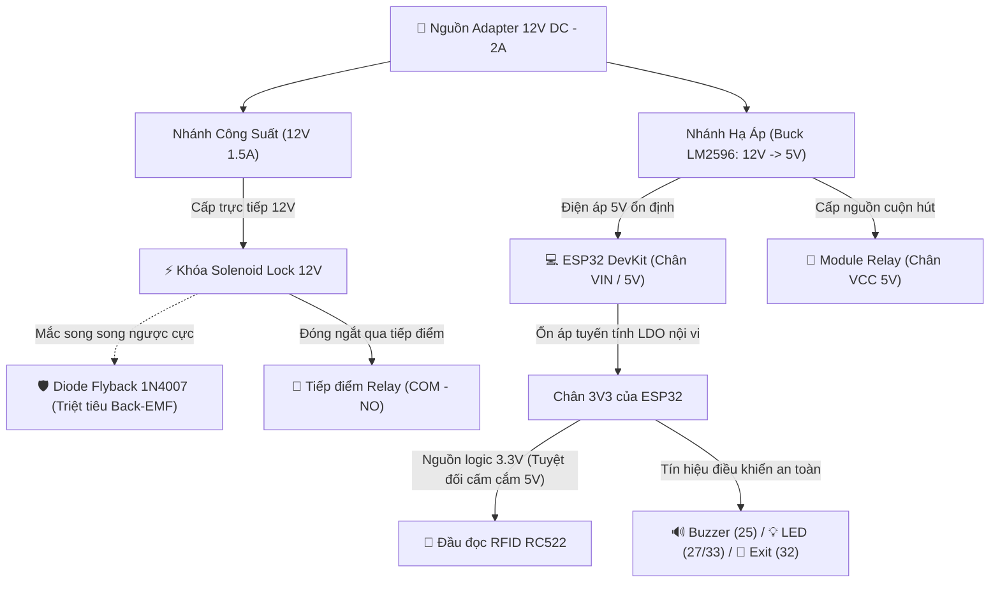
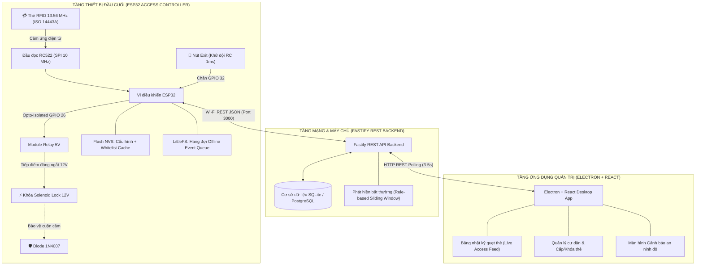
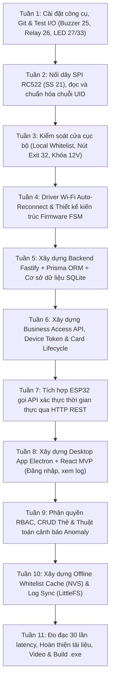
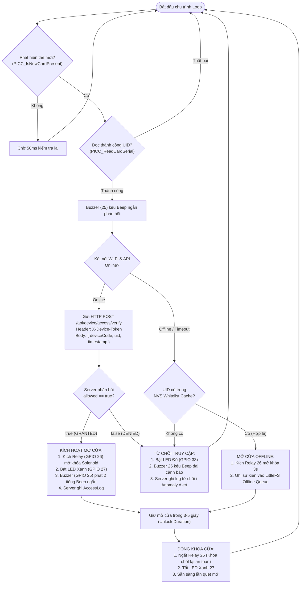
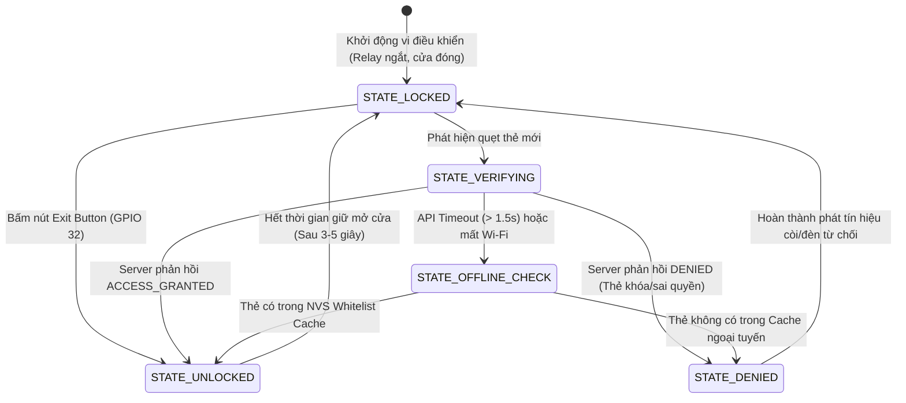
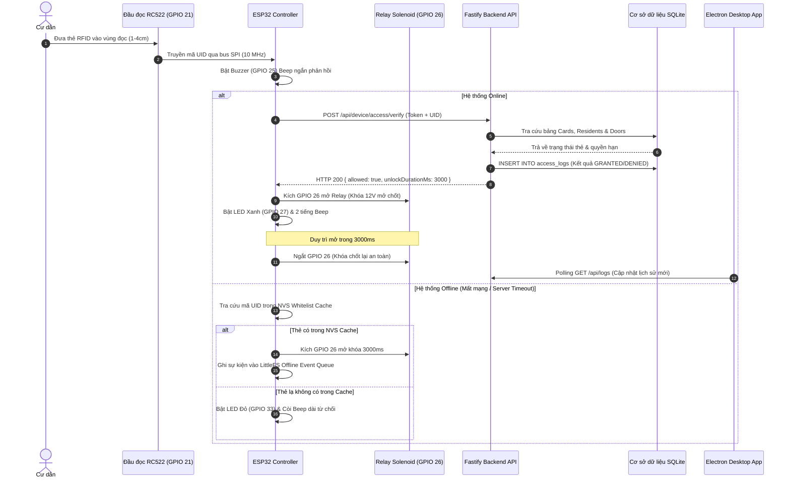

# 📘 SỔ TAY KỸ THUẬT CHUYÊN SÂU: SƠ ĐỒ KỸ THUẬT, SƠ ĐỒ QUY TRÌNH & CƠ SỞ LÝ THUYẾT
## Đề tài: Hệ thống kiểm soát cửa RFID & IoT tích hợp Desktop App (ESP32 + Fastify + Electron)

> **Tác giả:** Kỹ sư IoT & Hệ thống nhúng (NguyenHoangUy1305)  
> **Repository:** [NguyenHoangUy1305/iot-rfid-access-control](https://github.com/NguyenHoangUy1305/iot-rfid-access-control)  
> **Phiên bản:** 1.0 (MVP + Hướng nâng cấp mở rộng)  
> **Thời gian:** Tháng 11/2026 - Tháng 01/2027 (Khởi động: 01/11/2026)  
> **Phạm vi an toàn:** Mô hình thử nghiệm DC điện áp thấp (12V / 5V / 3.3V); tuyệt đối không nối điện lưới xoay chiều 220V.

---

## MỤC LỤC
1. [PHẦN 1: MỤC TIÊU VÀ PHẠM VI BẢO MẬT](#phần-1-mục-tiêu-và-phạm-vi-bảo-mật)
   - 1.1 Mục tiêu kỹ thuật cốt lõi
   - 1.2 Giới hạn kỹ thuật của thẻ MIFARE Classic & Triết lý phòng thủ đa lớp (Defense-in-Depth)
2. [PHẦN 2: CƠ SỞ LÝ THUYẾT ĐIỆN TỪ & NGUYÊN LÝ HOẠT ĐỘNG](#phần-2-cơ-sở-lý-thuyết-điện-từ--nguyên-lý-hoạt-động)
   - 2.1 Sóng vô tuyến RFID 13.56 MHz & Tiêu chuẩn ISO/IEC 14443 Type A
   - 2.2 Phương trình Maxwell-Faraday & Cơ chế nạp năng lượng cảm ứng Neumann
   - 2.3 Cơ chế biến điệu tải (Load Modulation) trên sóng mang phụ Subcarrier 848 kHz
   - 2.4 Cấu trúc bộ nhớ vi mạch thẻ MIFARE Classic 1K & Bảng phân tích Access Bits
   - 2.5 Tải cảm ứng Solenoid Lock 12V: Năng lượng từ trường, Back-EMF và Diode Flyback 1N4007
   - 2.6 Mạch cách ly quang Optocoupler PC817 chống nhiễu xuyên mass
   - 2.7 Hiện tượng dội phím cơ khí (Contact Bounce) & Mạch lọc thông thấp RC 1ms
   - 2.8 Chuẩn truyền thông SPI: Master/Slave, CPOL/CPHA Mode 0 vs I2C vs Wiegand 26/34
   - 2.9 Phân định kiến trúc lưu trữ: Flash NVS (Whitelist) vs LittleFS (Log Queue)
3. [PHẦN 3: SƠ ĐỒ KỸ THUẬT & SƠ ĐỒ ĐẤU NỐI MẠCH (PINOUT AN TOÀN)](#phần-3-sơ-đồ-kỹ-thuật--sơ-đồ-đấu-nối-mạch-pinout-an-toàn)
   - 3.1 Bảng ánh xạ chân GPIO chốt an toàn (Loại bỏ hoàn toàn Strapping Pins)
   - 3.2 Sơ đồ nguyên lý mạch điện phần cứng chi tiết (Hardware Schematics)
   - 3.3 Sơ đồ phân phối nguồn điện 2 tầng (Power Distribution)
   - 3.4 Sơ đồ kiến trúc kỹ thuật toàn hệ thống (System Architecture Diagram)
4. [PHẦN 4: SƠ ĐỒ LÀM & SƠ ĐỒ QUY TRÌNH THỰC HIỆN DỰ ÁN](#phần-4-sơ-đồ-làm--sơ-đồ-quy-trình-thực-hiện-dự-án)
   - 4.1 Quy trình 11 tuần triển khai thực chiến từ A-Z
   - 4.2 Sơ đồ thuật toán xử lý quẹt thẻ (Card Verification Flowchart)
   - 4.3 Sơ đồ máy trạng thái khóa cửa (Door State Machine)
   - 4.4 Sơ đồ tuần tự giao tiếp hệ thống (Sequence Diagram)
5. [PHẦN 5: TÀI LIỆU THAM KHẢO HỌC THUẬT](#phần-5-tài-liệu-tham-khảo-học-thuật)

---

# PHẦN 1: MỤC TIÊU VÀ PHẠM VI BẢO MẬT

### 1.1 Mục tiêu kỹ thuật cốt lõi
Xây dựng một hệ thống kiểm soát cửa hoàn chỉnh từ phần cứng vi điều khiển đến phần mềm máy tính:
- ESP32 đọc thẻ RFID qua module RC522, gửi yêu cầu xác thực tới máy chủ Fastify Backend qua mạng Wi-Fi bằng `X-Device-Token` riêng biệt.
- Điều khiển đóng ngắt Relay khóa cửa Solenoid 12V, còi Buzzer phát âm thanh phản hồi và LED báo trạng thái trực quan.
- Ứng dụng Desktop (Electron + React) cho phép ban quản lý cấp phát thẻ mới, khóa thẻ mất khẩn cấp, xem nhật ký quẹt thẻ thời gian thực và nhận cảnh báo an ninh.
- Cơ chế vận hành ngoại tuyến độc lập (Offline Fallback Engine): Cửa vẫn mở bình thường khi mất kết nối mạng nhờ bảng Whitelist lưu trong NVS Flash, tự động đồng bộ nhật ký sau khi mạng phục hồi.

### 1.2 Giới hạn kỹ thuật của thẻ MIFARE Classic & Triết lý phòng thủ đa lớp (Defense-in-Depth)
Trong các nghiên cứu an toàn thông tin kinh điển (như công trình của F. D. Garcia et al., ESORICS 2008), thuật toán mã hóa Crypto-1 của thẻ MIFARE Classic 1K đã được chứng minh là có thể bị giải mã trong thời gian ngắn, và các loại phôi thẻ thay đổi được UID ("Magic Card" UID Gen 1/2) được bán rộng rãi. Do đó, **UID không được coi là một khóa bảo mật tuyệt đối**.

**Mục tiêu đúng đắn của dự án là xây dựng kiến trúc phòng vệ đa tầng (Defense-in-Depth):**
1. **Xác thực thiết bị cửa:** Chỉ các thiết bị ESP32 sở hữu `X-Device-Token` hợp lệ mới được quyền gọi API xác thực.
2. **Quản lý trạng thái thẻ tập trung:** Thẻ chỉ mở được cửa nếu cơ sở dữ liệu xác nhận trạng thái `ACTIVE` và còn hạn sử dụng. Khi có sự cố mất thẻ, quản trị viên khóa thẻ trên Desktop App thì thẻ lập tức bị vô hiệu hóa toàn hệ thống.
3. **Phân quyền truy cập theo cửa (Door Permissions):** Cư dân chỉ mở được đúng cửa căn hộ hoặc cổng chung được cấp phép.
4. **Nhật ký kiểm toán toàn diện (Audit Logging):** Ghi nhận đầy đủ mọi lượt quẹt thẻ thành công hoặc bị từ chối kèm dấu thời gian thực.
5. **Thuật toán phát hiện bất thường (Rule-Based Anomaly Detection):** Tự động phát hiện các hành vi quét thẻ lạ liên tục hoặc dò mã brute-force để kích hoạt còi báo động.
6. **Mở rộng Rolling Counter (Advanced):** Lưu trữ số đếm sử dụng trong Data Block của thẻ để phát hiện các bản sao thẻ cũ bị rollback.

---

# PHẦN 2: CƠ SỞ LÝ THUYẾT ĐIỆN TỪ & NGUYÊN LÝ HOẠT ĐỘNG

### 2.1 Sóng vô tuyến RFID 13.56 MHz & Tiêu chuẩn ISO/IEC 14443 Type A
Hệ thống sử dụng sóng vô tuyến dải tần cao **High Frequency (HF) 13.56 MHz** tuân theo tiêu chuẩn quốc tế **ISO/IEC 14443 Type A**.
* Bước sóng trong không gian tự do:
  $$\lambda = rac{c}{f_c} = rac{3 	imes 10^8 	ext{ m/s}}{13.56 	imes 10^6 	ext{ Hz}} pprox 22.12 	ext{ m}$$
* Vùng cảm ứng trường gần (Near-Field Reactive Region):
  $$r < rac{\lambda}{2\pi} pprox rac{22.12}{6.28} pprox 3.52 	ext{ m}$$
  Khoảng cách đọc thực tế của thẻ thụ động (Passive Tag) với anten PCB của module RC522 đạt hiệu quả cao nhất ở cự ly **$1 \sim 4	ext{ cm}$**.

### 2.2 Phương trình Maxwell-Faraday & Cơ chế nạp năng lượng cảm ứng Neumann
Cuộn anten trên mạch PCB của RC522 phát ra từ trường biến thiên $B(t)$ ở tần số $13.56	ext{ MHz}$. Khi thẻ RFID đưa vào vùng từ trường, cuộn dây phẳng gồm nhiều vòng bên trong thẻ đón nhận từ thông biến thiên $\Phi(t)$. Theo định luật Maxwell-Faraday và định luật cảm ứng Neumann:
$$e = -rac{d\Phi}{dt} = -N rac{d}{dt} \iint_S ec{B}(t) \cdot dec{A}$$
Suất điện động cảm ứng $e$ được nắn dòng bởi mạch chỉnh lưu Diode Schottky tích hợp ngay bên trong chip thẻ và nạp vào tụ điện nội vi $C pprox 28	ext{ pF}$, tạo ra điện áp một chiều $V_{DD} pprox 2.5	ext{V} \sim 3.3	ext{V}$ cấp nguồn cho vi xử lý bên trong thẻ tự khởi động mà **hoàn toàn không cần pin nuôi** (Passive RFID Tag).

### 2.3 Cơ chế biến điệu tải (Load Modulation) trên sóng mang phụ Subcarrier 848 kHz
Thẻ RFID truyền dữ liệu ngược về đầu đọc bằng cách đóng/ngắt một transistor tải điện trở song song với cuộn anten của thẻ. Sự thay đổi dòng tiêu thụ này làm biến đổi nhẹ biên độ điện áp trên cuộn anten của đầu đọc RC522 (biến điệu biên độ ASK).
- Sóng mang phụ (Subcarrier) có tần số:
  $$f_s = rac{f_c}{16} = rac{13.56	ext{ MHz}}{16} = 848	ext{ kHz}$$
- Chiều từ Đầu đọc $	o$ Thẻ: Sử dụng mã hóa **Modified Miller** với độ sâu điều chế $100\%$ ASK.
- Chiều từ Thẻ $	o$ Đầu đọc: Sử dụng mã hóa **Manchester** đồng bộ xung nhịp subcarrier $848	ext{ kHz}$.

### 2.4 Cấu trúc bộ nhớ vi mạch thẻ MIFARE Classic 1K & Bảng phân tích Access Bits
Thẻ MIFARE Classic 1K có tổng dung lượng bộ nhớ là **1024 bytes (1 KB)** được phân chia:
* Gồm **16 Sector** (Sector 0 đến Sector 15). Mỗi Sector gồm **4 Block** (Block 0 đến Block 3), mỗi Block chứa đúng **16 bytes** dữ liệu ($16 	imes 4 	imes 16 = 1024	ext{ bytes}$).
* **Sector 0 - Block 0 (Manufacturer Block):** Chứa mã UID (4 hoặc 7 bytes) và byte kiểm tra BCC ($	ext{UID}_0 \oplus 	ext{UID}_1 \oplus 	ext{UID}_2 \oplus 	ext{UID}_3$). Ở thẻ chuẩn chính hãng NXP, block này là Read-Only cố định từ nhà máy.
* **Block 3 của mỗi Sector (Sector Trailer):**
  - Bytes 0 - 5: Khóa bảo mật `Key A` (6 bytes, mặc định `0xFF 0xFF 0xFF 0xFF 0xFF 0xFF`).
  - Bytes 6 - 9: 4 bytes bit truy cập (`Access Bits`), mã hóa quyền đọc/ghi riêng biệt cho từng Block trong Sector ($C_1, C_2, C_3$).
  - Bytes 10 - 15: Khóa bảo mật `Key B` (6 bytes).

### 2.5 Tải cảm ứng Solenoid Lock 12V: Năng lượng từ trường, Back-EMF và Diode Flyback 1N4007
Khóa chốt điện Solenoid Lock 12V là một tải thuần cảm có độ tự cảm $L pprox 100	ext{ mH}$ và điện trở nội $R pprox 8\Omega$.
- Dòng điện kéo qua cuộn dây: $I = rac{U}{R} = rac{12	ext{V}}{8\Omega} = 1.5	ext{ A}$.
- Năng lượng tích lũy trong từ trường: $E = rac{1}{2} L I^2 = rac{1}{2} 	imes 0.1 	imes (1.5)^2 = 0.1125	ext{ Joules}$.
- **Hiện tượng Sức điện động cảm ứng ngược (Back-EMF):**
  Khi tiếp điểm Relay ngắt điện, dòng điện bị giảm đột ngột từ $1.5	ext{ A}$ về $0$ trong thời gian $dt pprox 5\mu	ext{s}$. Theo định luật tự cảm:
  $$V_{	ext{kick}} = -L rac{di}{dt} = -(0.1	ext{ H}) 	imes rac{-1.5	ext{ A}}{5 	imes 10^{-6}	ext{ s}} = +300	ext{ V}!$$
  Điện áp ngược $300	ext{V}$ này sẽ đánh thủng tiếp điểm Relay, sinh tia lửa điện gây nhiễu điện từ (EMI) truyền ngược qua mass làm sập nguồn ESP32 (**Brownout Reset**).
- **Nguyên lý bảo vệ của Diode Flyback 1N4007:**
  Mắc một Diode 1N4007 **song song ngược cực tính** với cuộn dây khóa (Cathode có vạch trắng nối vào $+12	ext{V}$, Anode nối vào cực âm/Relay). Khi ngắt điện, Diode được phân cực thuận, tạo thành mạch vòng kín cho dòng điện cảm ứng tự tuần hoàn và tiêu tán năng lượng từ trường thành nhiệt an toàn, ghim điện áp ở mức an toàn $V_{clamp} = 12	ext{V} + 0.7	ext{V} = 12.7	ext{V}$.

### 2.6 Mạch cách ly quang Optocoupler PC817 chống nhiễu xuyên mass
Module Relay 5V tích hợp IC Optocoupler PC817, sử dụng tia hồng ngoại để kích mở Transistor công suất. Mạch này ngăn cách hoàn toàn đường mass số (`Digital GND`) của ESP32 với đường mass công suất (`Power GND`) của Relay và khóa từ, triệt tiêu nguy cơ xung nhiễu công nghiệp truyền ngược vào vi điều khiển.

### 2.7 Hiện tượng dội phím cơ khí (Contact Bounce) & Mạch lọc thông thấp RC 1ms
Nút bấm Exit Button (nối vào **GPIO 32**) có tiếp điểm cơ khí bị nảy lò xo trong khoảng $5 \sim 20	ext{ ms}$ khi nhấn.
- **Lọc phần cứng (Hardware RC Filter):** Mắc tụ gốm $C = 100	ext{ nF}$ song song với nút nhấn kết hợp điện trở kéo lên $R = 10	ext{ k}\Omega$. Hằng số thời gian mạch nạp:
  $$	au = R 	imes C = 10^4\Omega 	imes 10^{-7}	ext{F} = 1	ext{ ms}$$
  Mạch lọc thông thấp này triệt tiêu hoàn toàn các gai xung nhọn tần số cao.
- **Lọc phần mềm (Non-blocking Debounce):** Dùng bộ đếm `millis()` lọc ngưỡng $50	ext{ ms}$, không dùng `delay()`.

### 2.8 Chuẩn truyền thông SPI: Master/Slave, CPOL/CPHA Mode 0 vs I2C vs Wiegand 26/34
Dự án sử dụng giao tiếp SPI (Serial Peripheral Interface) Mode 0 ($CPOL=0, CPHA=0$) cho module RC522:
- Tốc độ xung nhịp đạt tới $10	ext{ MHz}$ (so với $400	ext{ kHz}$ của I2C), cho thời gian đọc thẻ tức thì $< 10	ext{ ms}$.
- Đường truyền tách biệt (`MOSI`, `MISO`, `SCK`, `SS`) giúp đường truyền ổn định và chống nhiễu tốt trên mô hình cửa thực tế.

### 2.9 Phân định kiến trúc lưu trữ: Flash NVS (Whitelist) vs LittleFS (Log Queue)
Để bảo vệ tuổi thọ của bộ nhớ Flash vi điều khiển:
- **NVS (Non-Volatile Storage):** Dùng lưu cấu hình hệ thống (Device Code, Wi-Fi, Token) và bảng Whitelist tối đa 50–100 thẻ (dữ liệu ít thay đổi, chỉ ghi khi có thẻ mới).
- **LittleFS (SPIFFS successor):** Dùng lưu tệp tin hàng đợi nhật ký sự kiện ngoại tuyến (`offline_queue`). LittleFS tích hợp thuật toán Dynamic Wear Leveling, trải đều các chu kỳ ghi tuần tự lên toàn bộ các block của Flash, tránh nguy cơ làm chai mòn hỏng sector Flash.

---

# PHẦN 3: SƠ ĐỒ KỸ THUẬT & SƠ ĐỒ ĐẤU NỐI MẠCH (PINOUT AN TOÀN)

### 3.1 Bảng ánh xạ chân GPIO chốt an toàn (Loại bỏ hoàn toàn Strapping Pins)

> ⚠️ **NGUYÊN TẮC KỸ THUẬT QUAN TRỌNG:** Trên chip ESP32, các chân `GPIO 0, 2, 4, 12, 15` là các chân **Strapping Pins** (chân cấu hình bootloader lúc khởi động). Để đảm bảo ESP32 **không bao giờ bị lỗi treo bootloop hay relay bị giật kích lúc cắm nguồn**, toàn bộ các linh kiện ngoại vi đã được bố trí vào các chân I/O tiêu chuẩn an toàn tuyệt đối:

| Thiết bị ngoại vi | Chân Module | Chân kết nối ESP32 (Chốt) | Điện áp | Chức năng kỹ thuật |
| :--- | :--- | :--- | :--- | :--- |
| **RFID-RC522** | **3.3V** | **3V3 (ESP32)** | 3.3V DC | ⚠️ **CẤM CẮM 5V** (Cháy IC MFRC522 lập tức!) |
| | **GND** | **GND** | 0V | Nối mass chung toàn mạch |
| | **RST** | **GPIO 22** | 3.3V Logic | Chân Reset phần cứng của RC522 |
| | **MISO** | **GPIO 19** | 3.3V Logic | SPI Master In Slave Out |
| | **MOSI** | **GPIO 23** | 3.3V Logic | SPI Master Out Slave In |
| | **SCK** | **GPIO 18** | 3.3V Logic | SPI Serial Clock ($10	ext{ MHz}$) |
| | **SDA (SS)** | **GPIO 21** | 3.3V Logic | SPI Chip Select (Active LOW, an toàn) |
| **Relay 5V Module** | **VCC** | **VIN (hoặc 5V)** | 5V DC | Cấp nguồn nuôi cuộn hút relay |
| | **GND** | **GND** | 0V | Nối mass chung |
| | **IN** | **GPIO 26** | 3.3V Logic | Kích mở Relay (Tránh strapping pin GPIO 4) |
| **Còi Active Buzzer**| **VCC (+)** | **GPIO 25** | 3.3V Logic | Còi phát âm thanh (Tránh strapping pin GPIO 2) |
| | **GND (-)** | **GND** | 0V | Mass chung |
| **LED Xanh (Thành công)**|**Anode (+)**| **GPIO 27** | 3.3V qua $220\Omega$ | Đèn báo xác thực thẻ hợp lệ |
| **LED Đỏ (Từ chối)** | **Anode (+)** | **GPIO 33** | 3.3V qua $220\Omega$ | Đèn báo từ chối thẻ / Cảnh báo an ninh |
| **Nút Nhấn Exit Button**|**Chân 1** | **GPIO 32** | PULLUP nội | Nút mở cửa từ bên trong (Tránh GPIO 15) |
| | **Chân 2** | **GND** | 0V | Nối mass khi nhấn nút |
| **Khóa Chốt Solenoid**| **Dây (+)** | **Nguồn +12V DC**| 12V DC (1.5A)| Nguồn Adapter 12V 2A rời |
| | **Dây (-)** | **Relay NO** | Tiếp điểm | Chân COM của Relay nối về Mass 12V |
| **Diode Flyback** | **Cathode** | **Khóa (+12V)** | Phân cực ngược | Vạch trắng nối vào nguồn dương 12V |
| | **Anode** | **Khóa (Dây -)** | Phân cực ngược | Mắc song song trực tiếp tại 2 cọc cuộn dây khóa |

---

### 3.2 Sơ đồ nguyên lý mạch điện phần cứng chi tiết (Hardware Schematics)

```text
       +-------------------------------------------------------------+
       |           SƠ ĐỒ NGUYÊN LÝ MẠCH PHẦN CỨNG CHUẨN AN TOÀN       |
       +-------------------------------------------------------------+

      [NGUỒN 12V DC 2A]
         │        │
         │ (+)    └──(GND)───────────────────────────────┐
         │                                               │
         ├───[Buck LM2596: 12V -> 5V]───(+) 5V──>[VIN]   │
         │                                  │    [ESP32] │
         │   ┌──────────────────────────────┴───>[GND]───┤ (Mass chung)
         │   │                                           │
         │   │   +-------------------------+             │
         │   │   |    ESP32 DEVKIT V1      |             │
         │   │   |                         |             │
         │   │   | 3V3 ─────────────────(3.3V) RFID RC522│
         │   │   | GND ─────────────────(GND)            │
         │   │   | GPIO 21 (SS)─────────(SDA)            │
         │   │   | GPIO 18 (SCK)────────(SCK)            │
         │   │   | GPIO 23 (MOSI)───────(MOSI)           │
         │   │   | GPIO 19 (MISO)───────(MISO)           │
         │   │   | GPIO 22 (RST)────────(RST)            │
         │   │   |                         |             │
         │   │   | GPIO 26 ─────────────(IN) RELAY 5V    │
         │   └───| 5V/VIN ──────────────(VCC) MODULE     │
         │       | GND ─────────────────(GND)            │
         │       |                         |             │
         │       | GPIO 25 ─────────────(+) ACTIVE BUZZER│
         │       | GPIO 27 ──[220Ω]─────(+) LED XANH     │
         │       | GPIO 33 ──[220Ω]─────(+) LED ĐỎ       │
         │       | GPIO 32 ─────────────[NÚT NHẤN EXIT]──┤
         │       +-------------------------+             │
         │                                               │
         ├───(+)12V────────┐                             │
         │                 │                             │
         │           [KHÓA TỪ 12V]                       │
         │            ▲         │                        │
         │     1N4007 │         │                        │
         │     Diode  │         ▼                        │
         │            └───(NO) RELAY (COM)───────────────┘
         │
         └───────────────────────────────────────────────────────────
```

---

### 3.3 Sơ đồ phân phối nguồn điện 2 tầng (Power Distribution)



---

### 3.4 Sơ đồ kiến trúc kỹ thuật toàn hệ thống (System Architecture Diagram)



---

# PHẦN 4: SƠ ĐỒ LÀM & SƠ ĐỒ QUY TRÌNH THỰC HIỆN DỰ ÁN

### 4.1 Quy trình 11 tuần triển khai thực chiến từ A-Z



---

### 4.2 Sơ đồ thuật toán xử lý quẹt thẻ (Card Verification Flowchart)



---

### 4.3 Sơ đồ máy trạng thái khóa cửa (Door State Machine)



---

### 4.4 Sơ đồ tuần tự giao tiếp hệ thống (Sequence Diagram)



---

# PHẦN 5: TÀI LIỆU THAM KHẢO HỌC THUẬT

1. **NXP Semiconductors.** *MFRC522 Standard Performance MIFARE and NTAG Frontend*, Product Data Sheet, Rev. 3.9, 2016.
2. **M. Balboa.** *MFRC522 Arduino RFID Library*, Official GitHub Repository.
3. **F. D. Garcia, P. van Rossum, R. Verdult, R. W. Schreur.** *Dismantling MIFARE Classic*, 13th European Symposium on Research in Computer Security (ESORICS), 2008.
4. **NIST (National Institute of Standards and Technology).** *Guidelines for Securing Radio Frequency Identification (RFID) Systems*, Special Publication 800-98, 2007.
5. **Espressif Systems.** *ESP32 Technical Reference Manual* & *ESP-IDF Programming Guide: Strapping Pins and GPIO Matrix*.
6. **Fastify Team.** *Fastify Framework Reference Documentation with TypeScript*.
7. **Prisma Team.** *Prisma ORM Documentation: SQLite & Data Migrations*.
8. **Electron Team.** *Electron Security Recommendations: Context Isolation and Inter-Process Communication*.
9. **OWASP Foundation.** *IoT Security Verification Standard (ISVS)* & *API Security Top 10*.
